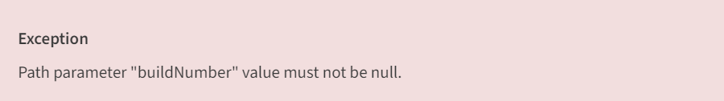

# [Common MS CI Pipeline Issues](https://eteamspace.internal.ericsson.com/display/DGBase/5.+Common+MS+CI+Pipeline+Issues)

***Quick Links:***

***-   Hummingbirds Support WoW:  [Support / Feature requests - Hummingbirds Support WoW](https://eteamspace.internal.ericsson.com/pages/viewpage.action?pageId=2019824766)***
***-   Hummingbirds Support ticket template:  [IDUN-13402](https://eteamproject.internal.ericsson.com/browse/IDUN-13402)  -  TEMPLATE: Support - Hummingbirds Support / New feature template - DO NOT EDIT (ONLY CLONE)  TO DO***

 

## **Overview**

-   This page captures  **Common CI Infra and Non-infra issues** observed in the microservice pipelines and how design teams can resolve them.
-   **Note**: To improve readability, we have categorized the errors according to the stages of the microservice pipelines.
-   The build failure indications in your Jenkins build page and this confluence page should be your first points of reference when you face an error or failure in your pipeline.
-   If you do not find the information you are looking for, please create a support ticket following the [Hummingbirds Support WoW](https://eteamspace.internal.ericsson.com/pages/viewpage.action?pageId=2019824766).
-   If you want to contribute to this space, contact the person on support - [Hummingbirds Calendar](https://eteamspace.internal.ericsson.com/display/DGBase/The+Hummingbirds).
-   **Intended Audience**: Users of microservice pipelines on [fem1s11-eiffel216](https://fem1s11-eiffel216.eiffel.gic.ericsson.se:8443/jenkins/) and [fem6s11-eiffel216](https://fem6s11-eiffel216.eiffel.gic.ericsson.se:8443/jenkins/).

 

## **Declarative: Checkout SCM**

---

**Device or resource busy**

**Sample Error**: java.nio.file.FileSystemException: /proj/eiffel216_config_fem1s11/agents/RHEL7_GE_Docker_2/workspace/eric-oss-pmcounter-filetrans_PreCodeReview/target/surefire/.nfs000000003ff0209100007666: Device or resource busy.

**Root Cause**:

-   Jenkins automatically cleans a job's workspace before any new build.
-   This error happens when Jenkins cannot delete one or more files during workspace cleanup.
-   This issue is seen only in non-hybrid microservice pipelines.
-   Hummingbirds has included a permanent fix for this error in the hybrid microservice pipelines.

**Resolution**:

-   Please manually clean the workspace using the user utility job [User_Utility_Delete_Project_Workspace](https://fem1s11-eiffel216.eiffel.gic.ericsson.se:8443/jenkins/job/User_Utility_Delete_Project_Workspace/).
-   This user utility job removes your Jenkins job folder from the Grid Engine workspaces.
-   Once you have cleaned the Jenkins workspace, please re-trigger the failed build.

**Maximum checkout retry attempts reached, aborting**

**Sample Error**: Maximum checkout retry attempts reached, aborting.

**Root Cause**:

-   Temporary Gerrit connectivity issue. (or)
-   Incorrect Jenkins job configuration.

**Resolution**:

-   Please re-trigger the failed build.
-   If the issue persists, please create a support ticket on Hummingbirds to check the Jenkins job configuration and Gerrit connectivity.

**The Jenkins job did not find a Jenkinsfile**

**Sample Error**: ERROR: /proj/eiffel216_config_fem1s11/eiffel_home/jobs/eric-oss-architecture-docs_Publish/workspace/publish.Jenkinsfile not found.

**Root Cause**:

-   PCR pipelines expect a Jenkinsfile called "precodereview.Jenkinsfile" in the root folder.
-   Publish pipelines expect a Jenkinsfile called "publish.Jenkinsfile" in the root folder.
-   This error happens if you do not have the Jenkinsfiles, the Jenkinsfile name doesn't match the naming convention, or the placement of the Jenkinsfile is incorrect.
-   This issue is seen only in non-hybrid microservice pipelines.

**Resolution**:

-   Please ensure you adhere to the expected naming conventions for the Jenkinsfiles.
-   Please ensure you have the Jenkinsfiles in the root of your Gerrit repo.
-   If required, please create a support ticket on Hummingbirds to update the Jenkins job configuration to match your current setup.
---
**Couldn't find any revision to build. Verify the repository and branch configuration for this job**

**Sample Error**: Couldn't find any revision to build. Verify the repository and branch configuration for this job.

**Root Cause**:

-   Temporary Gerrit connectivity issue. (or)
-   Incorrect Jenkins job configuration.

**Resolution**:

-   Please re-trigger the failed build.
-   If the issue persists, please create a support ticket on Hummingbirds to check the Jenkins job configuration and Gerrit connectivity.

 

## **Prepare**

---

No failures recorded.

 

## **Init**

---

**bad certificate**

**Sample Error**: Please check your TLS client certification settings: remote error: tls: bad certificate.

**Root Cause**: Jenkins TLS certificate has expired.

**Resolution**: Hummingbirds have a permanent fix in place to renew the certificate.

 

## **Lint**

----

**Can't find property: [open_api_spec_directory]**

**Sample Error**: Can't find property: [open_api_spec_directory], it is not set in properties

**Root Cause**:

-   The "OpenAPI spec" step expects a property called "open_api_spec_directory" in the common-properties.yaml
-   This issue happens when you have not set the property in common-properties.yaml

**Resolution**:

-   Please add the property "open_api_spec_directory" in the common-properties.yaml
-   For more info, please refer to  [Define OAS Directory Path Rollout](https://eteamspace.internal.ericsson.com/display/DGBase/Define+OAS+Directory+Path+Rollout)

**HelmDrCkRun:127 - Execution finished with return code (1)**

**Sample Error**: HelmDrCkRun:127 - Execution finished with return code (1)

**Root Cause**:

-   The "lint:helm-chart-check" step in the "lint helm design rule checker" stage validates ADP Helm design rules against your microservice.
-   This error happens if one or more helm design rule checks have failed.

**Resolution**:

-   Please refer to ".bob/design-rule-check-report.html" in the Jenkins workspace and resolve the failed design rules.
-   For more info on the upcoming design rule checks, please refer to the Jenkins build page (applicable for hybrid pipelines only)
-   You can find more info on the DR exemption process in the [DR Exemption User Guide](https://eteamspace.internal.ericsson.com/display/DGBase/9.+Design+rule+%28DR%29+Exemption+handling).
-   Some files do not have the expected license header.

**Sample Error**: Failed to execute goal com.mycila:license-maven-plugin:3.0:check (default-cli) on project eric-oss-core-slice-assurance-cfg: Some files do not have the expected license header.

**Root Cause**:

-   The "lint:license-check" step in the "Lint code" stage checks for license headers in the files.
-   This error happens if one or more files do not have the expected license header.

**Resolution**:

-   Locate the files that require license headers. Please refer to the console log text for "[WARNING] Missing header in:"
-   Add the expected license header in those files -  [Sample](https://gerrit.ericsson.se/plugins/gitiles/OSS/com.ericsson.oss.ci/oss-common-ci-utils/+/refs/heads/dVersion-2.0.0-hybrid/dsl/scripts/helm-dr-checker.py).
-   Please ensure you have the licenses defined in the license/ directory in your repo - [License headers](https://gerrit.ericsson.se/plugins/gitiles/OSS/com.ericsson.oss.ci.test/eric-oss-common-ci-pocs-test01/+/refs/heads/master/license/).
-   Please ensure you have declared the license as a valid header in your pom.xml - [Sample pom.xml](https://gerrit.ericsson.se/plugins/gitiles/OSS/com.ericsson.oss.ci.test/eric-oss-common-ci-pocs-test01/+/refs/heads/master/pom.xml) (please search for "validHeader")
-   If you want to exclude a file from license validation, please add the file in your pom.xml under <excludes> section of license-maven-plugin -  [Sample](https://gerrit.ericsson.se/#/c/15898248/31/src/main/resources/archetype-resources/pom.xml).

 

## **Build**

---

**Unsupported transport protocol arm1s11-eiffel052.eiffel.gic.ericsson.se: java.util.NoSuchElementException**

**Sample Error**: Unsupported transport protocol arm1s11-eiffel052.eiffel.gic.ericsson.se: java.util.NoSuchElementException

**Root Cause**:

-   The settings.xml does not have the dependencies to pull down artifacts from arm1s11-eiffel052.

**Resolution**:

-   Please ensure you are using the settings file "maven.settings.oss.3PP.artifactory".
-   If you are using a hybrid version of the microservice pipelines, please set "SETTINGS_CONFIG_FILE_NAME=maven.settings.oss.3PP.artifactory" in the ci/local_pipeline_env.txt - [Sample](https://gerrit.ericsson.se/plugins/gitiles/OSS/com.ericsson.oss.ci.test/eric-oss-common-ci-pocs-test01/+/refs/heads/master/ci/local_pipeline_env.txt).
-   If you use a non-hybrid version of the microservice pipelines, please create a support ticket on Hummingbirds to update the settings.xml file name in your Jenkins job configuration.

**release version 17 not supported**

**Sample Error**: Failed to execute goal org.apache.maven.plugins:maven-compiler-plugin:3.10.1:compile (default-compile) on project eric-oss-data-collection-controller: Fatal error compiling: error: release version 17 not supported -> [Help 1]

**Root Cause**:

-   Unsupported Java version.
-   You need the Java 17 version to build the source code.

**Resolution**:

-   Please ensure you are using the builder image "armdocker.rnd.ericsson.se/proj-adp-cicd-drop/bob-java17mvnbuilder" in your ruleset file.
-   If you use a hybrid version of the microservice pipelines, please set "JAVA_17=true" in the ci/local_pipeline_env.txt - [Sample](https://gerrit.ericsson.se/plugins/gitiles/OSS/com.ericsson.oss.dmi/eric-oss-data-collection-controller/+/refs/heads/master/ci/local_pipeline_env.txt).
-   If you use a non-hybrid version of the microservice pipelines, please update the builder image in the ruleset2.0.yaml file.

**There has been local modifications made**

**Sample Error**: There HAS been local modifications made.

**Root Cause**: One or more files have been modified at run time.

**Resolution**: Please refer to  [Build - There has been local modifications made](https://eteamspace.internal.ericsson.com/display/DGBase/Build+-+There+has+been+local+modifications+made)

**Could not parse metadata maven-metadata-local.xml**

**Sample Error**: Failed to install metadata com.ericsson.oss.dmi:eric-oss-enm-fns/maven-metadata.xml: Could not parse metadata /proj/mvn/.m2/repository/com/ericsson/oss/dmi/eric-oss-enm-fns/maven-metadata-local.xml

**Root Cause**: Corrupted maven file.

**Resolution**:

-   Please manually delete the corrupted maven file using the utility job  [User_Utility_Delete_Corrupted_Maven_File](https://fem1s11-eiffel216.eiffel.gic.ericsson.se:8443/jenkins/job/User_Utility_Delete_Corrupted_Maven_File/).
-   This user utility job deletes the corrupted maven file from the .m2/repository/ directory.
-   Please re-trigger the failed build manually.

## **Docs Stream**

----------

### Generate Docs

No failures recorded.

 

### Open API Spec

No failures recorded.

 

## **FOSSA Stream**

---

### Maven Dependency Tree Check

No failures recorded.

   

### 3PP Analysis

**TypeError: 'NoneType' object is not subscriptable**

**Sample Error**:  TypeError: 'NoneType' object is not subscriptable

**Root Cause**:

-   Dependencies-metadata.yaml is empty.

**Resolution**:

-   Add at least one line in the dependencies-metadata.yaml.
-   Sample CR:  [https://gerrit.ericsson.se/#/c/16106172/11/ci-cd/config/dependencies/dependencies-metadata.yaml](https://gerrit.ericsson.se/#/c/16106172/11/ci-cd/config/dependencies/dependencies-metadata.yaml)
-   For more info, please refer to  [SCAS user guide](https://confluence-oss.seli.wh.rnd.internal.ericsson.com/x/dND_Iw).

**BlockingIOError: [Errno 11] Resource temporarily unavailable**

**Sample Error**:  BlockingIOError: [Errno 11] Resource temporarily unavailable

**Root Cause**:

-   Intermittent issue with the FOSSA server.

**Resolution**:

-   Please retrigger the failed build.

 

### Dependency Validate

No failures recorded.

**Others**

#### specified team 'None' not found

**Sample Error**: specified team 'None' not found.

**Root Cause**: Missing property "fossa-team-name" in the common-properties.yaml.

**Resolution**:

-   Please update your common-properties.yaml file with the name of your FOSSA team -  [Sample](https://gerrit.ericsson.se/plugins/gitiles/OSS/com.ericsson.oss.air/eric-oss-pm-stats-exporter/+/refs/heads/master/common-properties.yaml).
-   For more info, please refer to  [FOSSA User Guide](https://eteamspace.internal.ericsson.com/display/DGBase/11.+FOSSA+Scanning).

 

## **Image Stream**

---

### Image

**ImageDrCkRun:115 - Execution finished with return code (1)**

**Sample Error**: ImageDrCkRun:115 - Execution finished with return code (1)

**Root Cause**:

-   The "image-dr-check" step validates ADP Image design rules against your microservice.
-   This error happens if one or more image design rule checks have failed.

**Resolution**: Please refer to ".bob/check-image/image-design-rule-check-report.html" in the Jenkins workspace and resolve the failed design rules.

**no space left on device**

**Sample Error**:

-   no space left on device (or)
-   needs 200KB on the filesystem.

**Root Cause**: GridEngine agent disk space overflow - not enough space left on the GridEngine.

**Resolution**:

-   Hummingbirds have a permanent fix in place.
-   We have increased the Grid Engine memory space to 200GB and have a cleanup job that runs periodically to clean up memory space.

 

### Package

**An image does not exist locally with the tag**

**Sample Error**:  An image does not exist locally with the tag: armdocker.rnd.ericsson.se/proj-est-policy/eric-oss-pf-acm-runtime

**Root Cause**: The image you are trying to push is not available on the GridEngine.

**Resolution**: Please ensure an image is built with the required tag and is locally available for docker push.

**tag does not exist**

**Sample Error**:  tag does not exist: armdocker.rnd.ericsson.se/proj-eric-oss-ci-internal/eric-oss-flow-automation-db:1.9.0-h03e5c1fb

**Root Cause**: The image you are trying to push is not available on the GridEngine.

**Resolution**: Please ensure an image is built with the required tag and is locally available for docker push.

**User is unauthorized to upload**

**Sample Error**:  unauthorized: User is unauthorized to upload to docker-v2-global-local/proj-eric-oss-ci-internal/eric-oss-flow-automation/_uploads

**Root Cause**:

-   Incorrect configurations (or)
-   Docker config intermittent issue

**Resolution**:

-   Please ensure you use the "SELI_ARTIFACTORY" credentials for uploading the artifacts.
-   Please re-trigger the failed build after some time.
-   If the issue persists, please create a support ticket on Hummingbirds.

 

## **Sonar Stream**

---

### **Test**

**There are test failures**

**Sample Error**: Error: Failed to execute goal org.apache.maven.plugins:maven-surefire-plugin:2.22.2:test (default-cli) on project enm-notification-adapter-app: There are test failures.

**Root Cause**: One or more tests have failed.

**Resolution**: Please debug and fix your test failures.

**Please refer to target/surefire-reports for the individual test results.**

**Sample Error**:  Please refer to /proj/eiffel216_config_fem6s11/agents/RHEL7_GE_Docker_3/workspace/eric-oss-osm_PreCodeReview_Hybrid/target/surefire-reports for the individual test results.

**Root Cause**: One or more tests have failed.

**Resolution**: Please debug and fix your test failures

 

### Generate Contract Test Coverage Report

No failures recorded.

 

### SonarQube

**SonarQube server [[https://codeanalyzer2.internal.ericsson.com](https://codeanalyzer2.internal.ericsson.com/)] can not be reached**

**Sample Error**: [ERROR] SonarQube server [[https://codeanalyzer2.internal.ericsson.com](https://codeanalyzer2.internal.ericsson.com/)] can not be reached

**Root Cause**: Intermittent issue or SonarQube server down.  

**Resolution**: Please try retriggering the build after some time. If the issue persists and if the codeanalyzer GUI is not reachable then create a ticket to Team Daksha.

**Connect timed out**

**Sample Error**: Fail to request url:  [https://codeanalyzer2.internal.ericsson.com/api/new_code_periods/show.protobuf?project=com.ericsson.oss.topology%3Aeric-oss-ran-topology-adapter&branch=master](https://codeanalyzer2.internal.ericsson.com/api/new_code_periods/show.protobuf?project=com.ericsson.oss.topology%3Aeric-oss-ran-topology-adapter&branch=master): Connect timed out

**Root Cause**: Intermittent issue or SonarQube server down.  

**Resolution**: Please try retriggering the build after some time. If the issue persists and if the codeanalyzer GUI is not reachable then create a ticket to Team Daksha

**Quality gate failure**

**Sample Error**: ERROR: Pipeline aborted due to quality gate failure!

**Root Cause**: The new code didn't pass the quality gate  

**Resolution**: Design teams have to fix the quality gate failure from their end.

 

## **K8S Resource Lock**

---

No failures recorded.

 

## **Create Namespace**

---

**Error from server (AlreadyExists): namespaces already exists**

**Sample Error**: Error from server (AlreadyExists): namespaces "namespace14" already exists

**Root Cause**:

-   The namespace reserved by the build was left behind undeleted on the KAAS cluster by a previous Jenkins build.
-   Please verify if this error is the actual cause of the failure.

**Resolution**:

-   Please ensure you have implemented the namespace precheck in your pipeline - [Sample](https://gerrit.ericsson.se/plugins/gitiles/OSS/com.ericsson.oss.ci/oss-common-ci-utils/+/refs/heads/dVersion-2.0.0-hybrid/dsl/rulesetFiles/common_ruleset2.0.yaml) (please search for "namespace-precheck").
-   The fix is already included in the Hybrid microservices.

 

## **Helm Install**

---

**Error from server (AlreadyExists): namespaces already exists**

**Sample Error**: Error from server (AlreadyExists): namespaces "namespace14" already exists

**Root Cause**:

-   The namespace reserved by the build was left behind undeleted on the KAAS cluster by a previous Jenkins build.
-   Please verify if this error is the actual cause of the failure.

**Resolution**:

-   Please ensure you have implemented the namespace precheck in your pipeline - [Sample](https://gerrit.ericsson.se/plugins/gitiles/OSS/com.ericsson.oss.ci/oss-common-ci-utils/+/refs/heads/dVersion-2.0.0-hybrid/dsl/rulesetFiles/common_ruleset2.0.yaml) (please search for "namespace-precheck").
-   The fix is already included in the Hybrid microservices.

**Cannot impersonate resource "userextras/principalid" in API group "authentication.k8s.io" at the cluster scope**

**Sample Error**: Error: userextras.authentication.k8s.io "activedirectory_user://CN=****,OU=CA,OU=SvcAccount,OU=P001,OU=ID,OU=Data,DC=ericsson,DC=se" is forbidden: User "system:serviceaccount:cattle-impersonation-system:cattle-impersonation-u-lewztb6tti" cannot impersonate resource "userextras/principalid" in API group "authentication.k8s.io" at the cluster scope.

**Root Cause**: Known issue with rancher 2.6.3

**Resolution**:

-   A permanent fix was delivered as a part of IDUN-20163.
-   If the issue persists, please create a support ticket on Hummingbirds.

**Error: timed out waiting for the condition**

**Sample Error**: Error: timed out waiting for the condition.

**Root Cause**: Not all the pods are up and running.

**Resolution**:

-   Verify if all the pods are up and running.
-   Please note that this is not a CI issue.
-   Please refer to the archived K8s logs for more info.

**Error: UPGRADE FAILED: post-upgrade hooks failed: timed out waiting for the condition**

**Sample Error**:  Error: UPGRADE FAILED: post-upgrade hooks failed: timed out waiting for the condition

**Root Cause**: Not all the pods are up and running.

**Resolution**:

-   Verify if all the pods are up and running.
-   Please note that this is not a CI issue.
-   Please refer to the archived K8s logs for more info.

**Error: repository name (cncs-repo) already exists, please specify a different name**

**Sample Error**:  Error: repository name (cncs-repo) already exists, please specify a different name.

**Root Cause**: A repository with the same name already exists in repository.yaml.

**Resolution**:

-   Change the name of the repository in the helm repo add command. Refer  [local_ruleset.yaml | gerrit.ericsson Code Review](https://gerrit.ericsson.se/#/c/16811168/15/ci/local_ruleset.yaml)

 

## **Vulnerability Analysis**

---

 

### Anchore-Grype

**The client does not have permission for manifest**

**Sample Error**: Unable to use DockerDaemon source: pull failed: Error response from daemon: unauthorized: The client does not have permission for manifest.

**Root Cause**: Intermittent issue with the ADP scan tool.

**Resolution**:

-   Please re-trigger the failed build.
-   If the issue persists, please create a support ticket on Hummingbirds.

**Failed to load vulnerability db**

**Sample Error**:  Failed to load vulnerability db: unable to update vulnerability database: unable to download db.

**Root Cause**: Intermittent issue with the ADP scan tool.

**Resolution**:

-   Please re-trigger the failed build.
-   If the issue persists, please create a support ticket on Hummingbirds.

   

### **Hadolint**

No failures recorded.

   

### Kubeaudit

No failures recorded.

   

### Kubehunter

No failures recorded.

   

### Kubesec

No failures recorded.

   

### NMAP Unicorn

**The value "config/nmap_config.yaml" provided is not a readable file**

**Sample Error**: The value "config/nmap_config.yaml" provided is not a readable file.

**Root Cause**: Missing configuration file for NMAP Unicorn scan.

**Resolution**:

-   Please ensure that you have the nmap_config.yaml in the config/ directory - [Sample](https://gerrit.ericsson.se/plugins/gitiles/OSS/com.ericsson.oss.ci.test/eric-oss-common-ci-pocs-test01/+/refs/heads/master/config/nmap_config.yaml).
-   For more info, please refer to the [NMAP Rollout document](https://confluence-oss.seli.wh.rnd.internal.ericsson.com/x/QvsWIg).

**AttributeError: 'NoneType' object has no attribute 'status'**

**Sample Error**: The value "config/nmap_config.yaml" provided is not a readable file.

**Root Cause**: Incorrect configurations for NMAP Unicorn scan.

**Resolution**:

-   Please replace "eric-ms-chassis" to your helm chart name in your nmap_config.yaml in the config/ directory - [Sample](https://gerrit.ericsson.se/plugins/gitiles/OSS/com.ericsson.oss.ci.test/eric-oss-common-ci-pocs-test01/+/refs/heads/master/config/nmap_config.yaml).
-   For more info, please refer to the [NMAP Rollout document](https://confluence-oss.seli.wh.rnd.internal.ericsson.com/x/QvsWIg).

   

### Trivy

**The client does not have permission for manifest**

**Sample Error**:  UNAUTHORIZED: The client does not have permission for manifest.

**Root Cause**: Intermittent issue with the ADP scan tool.

**Resolution**:

-   Please re-trigger the failed build.
-   If the issue persists, please create a support ticket on Hummingbirds.

**No such image: armdocker.rnd.ericsson.se/proj-adp-cicd-drop/trivy-inline-scan:latest**

**Sample Error**:  No such image: armdocker.rnd.ericsson.se/proj-adp-cicd-drop/trivy-inline-scan:latest

**Root Cause**:

-   Intermittent issue with the Artifactory. (or)
-   Incorrect configurations.

**Resolution**:

-   Please ensure that you use SELI_ARTIFACTORY credentials to pull down the trivy image and the image exists in the artifactory.
-   Please re-trigger the failed build.
-   If the issue persists, please create a support ticket on Hummingbirds.

   

### X-Ray

**Bad Credentials**

**Sample Error**: Bad Credentials. User-supplied configuration is wrong.

**Root Cause**:

-   Intermittent issue with the ADP scan tool. (or)
-   Incorrect configurations.

**Resolution**:

-   Please ensure you have the correct configurations in place - [Sample](https://gerrit.ericsson.se/plugins/gitiles/OSS/com.ericsson.oss.ci.test/eric-oss-common-ci-pocs-test01/+/refs/heads/master/config/xray_report.config).
-   Please ensure you upload the docker image to "proj-eric-oss-ci-internal-docker-global/proj-eric-oss-ci-internal/" and fetch the xray report from the same repository.
-   Please ensure you use SELI_ARTIFACTORY credentials to fetch the xray report.
-   Please re-trigger the failed build.
-   If the issue persists, please create a support ticket on Hummingbirds.

**Artifact doesn't exist or not indexed/cached in Xray**

**Sample Error**:  Artifact doesn't exist or not indexed/cached in Xray.

**Root Cause**:

-   Intermittent issue with the Artifactory. (or)
-   Incorrect configurations.

**Resolution**:

-   Please ensure you have the correct configurations in place - [Sample](https://gerrit.ericsson.se/plugins/gitiles/OSS/com.ericsson.oss.ci.test/eric-oss-common-ci-pocs-test01/+/refs/heads/master/config/xray_report.config).
-   Please ensure you upload the docker image to "proj-eric-oss-ci-internal-docker-global/proj-eric-oss-ci-internal/" and fetch the xray report from the same repository.
-   Please ensure you use SELI_ARTIFACTORY credentials to fetch the xray report.
-   Please note that if there is a long queue in the Artifactory for xray scan, the Jenkins build will fail.
-   Please re-trigger the failed build after some time.
-   If the issue persists, please create a support ticket on Hummingbirds.

  
**Error in connection or non-200 HTTP status: http error while doing query: HTTP request resulted in HTTP status: [404]**

**Sample Error**:  Error in connection or non-200 HTTP status: http error while doing query: HTTP request resulted in HTTP status: [404]

**Root Cause**: Connectivity issue with the xray.

**Resolution**:

-   Please re-trigger the failed build after some time.
-   If the issue persists, please create a support ticket on Hummingbirds  to create a support ticket on the ARM team.

 

### ZAP Scan
*****ZAP User Guide:**  [https://confluence-oss.seli.wh.rnd.internal.ericsson.com/x/g3V4J](https://confluence-oss.seli.wh.rnd.internal.ericsson.com/x/g3V4J)****

**Readable ZAP configuration yaml file not found.**

**Sample Error**:  Readable ZAP configuration yaml file not found.

**Root Cause**: Missing configuration file for ZAP scan.

**Resolution**:

-   Please ensure that you have the zap_config.yaml in the config/ directory - Sample.
-   Please refer to the "ZAP Configuration File"  section in the [ZAP User Guide](https://confluence-oss.seli.wh.rnd.internal.ericsson.com/x/g3V4J)  for more info.  

**KeyError: 'endpoints'**

**Sample Error**: KeyError: 'endpoints'

**Root Cause**: You do not have the "endpoints" section in the ZAP configuration file.

**Resolution**:

-   Ensure you have specified at least one endpoint in the ZAP configuration file.
-   Please refer to the "ZAP Configuration File"  section in the [ZAP User Guide](https://confluence-oss.seli.wh.rnd.internal.ericsson.com/x/g3V4J)  for more info.
 
**Remove leading '/' from member names**

**Sample Error**: Remove leading '/' from member names

**Root Cause**: You have specified '/' at the of the directory paths in the ZAP configuration file.

**Resolution**:

-   Ensure you have removed the leading '/' from the config.
-   Please refer to the "ZAP Configuration File"  section in the [ZAP User Guide](https://confluence-oss.seli.wh.rnd.internal.ericsson.com/x/g3V4J)  for more info.

**AssertionError**

**Sample Error**: assert scan_type in allowed_scan_types. AssertionError.

**Root Cause**: You have specified an unsupported scan type in the ZAP configuration file.

**Resolution**:

-   Ensure you have specified the permitted scan types - "full", "api" or "all".
-   Please refer to the "ZAP Configuration File"  section in the [ZAP User Guide](https://confluence-oss.seli.wh.rnd.internal.ericsson.com/x/g3V4J)  for more info.

**found character '\t' that cannot start any token**

**Sample Error**: found character '\t' that cannot start any token

**Root Cause**: Alignment issue in the ZAP configuration file.

**Resolution**:

-   Please fix your config file alignment.
-   Please refer to the "ZAP Configuration File"  section in the [ZAP User Guide](https://confluence-oss.seli.wh.rnd.internal.ericsson.com/x/g3V4J)  for more info.

**error: one of src or dest must be a remote file specification**

**Sample Error**: error: one of src or dest must be a remote file specification

**Resolution**:

-   Please remove the space from your endpoint name in your config file.
-   Please refer to the "ZAP Configuration File"  section in the [ZAP User Guide](https://confluence-oss.seli.wh.rnd.internal.ericsson.com/x/g3V4J)  for more info.

 

## **Generate Vulnerability report V2.0**

---

**The value [config/va_html_config.yaml] provided is not a valid file path**

**Sample Error**:  doc-handler generate: error: argument --config: The value [config/va_html_config.yaml] provided is not a valid file path, or it is not accessible for the user!

**Root Cause**: Missing configuration file for "generate-VA-report-V2:va-report-to-html" step.

**Resolution**:

-   Please ensure that you have the  va_html_config.yaml  in the config/ directory - [Sample](https://gerrit.ericsson.se/plugins/gitiles/OSS/com.ericsson.oss.ci.test/eric-oss-common-ci-pocs-test01/+/refs/heads/master/config/va_html_config.yaml).
-   For more info, please refer to the  [VA Readable Report Rollout](https://confluence-oss.seli.wh.rnd.internal.ericsson.com/x/i_f7Ig).

   

## **Eridoc Upload**

---

**The user does not have write access to the specified folder**

**Sample Error**: The user does not have write access to the specified folder  https://eridoc.internal.ericsson.com/eridoc/?docbase=eridoca&locateId=0b004cffcbb4cd8f], please fix user access rights, grant either 'Write' or 'Delete' basic permission, and re-run!

**Root Cause**: The functional user 'ossadmin' do not have the required permission to access your Eridoc folder.

**Resolution**:

-   Please ensure the functional user has the required permissions.
-   If you do not have the required permissions, contact the CM team to grant ossadmin user write permissions to your eridoc folder.
-   For more info, please refer to the [Eridoc User Guide](https://confluence-oss.seli.wh.rnd.internal.ericsson.com/x/FSqqIw).
-   If you already have the required setup and still face this error, please create a support ticket on Hummingbirds - as this could be an issue with the Eridoc tool itself.

**Connection aborted**

**Sample Error**: [eridoclib.eridoc_config] - ERROR - ('Connection aborted.', RemoteDisconnected('Remote end closed connection without response')).

**Root Cause**: Connectivity issue with Eridoc.

**Resolution**:

-   Please re-trigger the failed build.
-   If the issue persists, please create a support ticket on Hummingbirds.

**Design_EridocUpload_StrategyError_OfficialCI**

**Sample Error**: eridoclib.eridoc_error.EridocException: Document type [1597] and strategy[latest]are mutually exclusive  

**Root Cause**: Strategy is not correct for document type 1597.

**Resolution**:

-   Change the Strategy from latest to ordinal in the eridoc_config,yaml file.
-   Sample CR:  [Change I181688fa: [IDUN-94443] Support: Task [generate-pri:generate-pri-inputs] fails | gerrit.ericsson Code Review](https://gerrit.ericsson.se/#/c/16339133/)

 

## **Publish**

---

**There are test failures**

**Sample Error**: Failed to execute goal org.apache.maven.plugins:maven-surefire-plugin:2.22.2:test (default-cli) on project enm-notification-adapter-app: There are test failures.

**Root Cause**: One or more tests have failed.

**Resolution**: Please debug and fix your test failures.

**Cannot prepare the release because you have local modifications**

**Sample Error**: [ERROR] Failed to execute goal org.apache.maven.plugins:maven-release-plugin: prepare (default-cli) on project eric-oss-flow-automation: Cannot prepare the release because you have local modifications

**Root Cause**: You have uncommitted local modifications.

**Resolution**: Please refer to [https://confluence-oss.seli.wh.rnd.internal.ericsson.com/x/YfTwHw](https://confluence-oss.seli.wh.rnd.internal.ericsson.com/x/YfTwHw)

**Updates were rejected because the remote contains work that you do not have locally**

**Sample Error**: Unable to commit files. Updates were rejected because the remote contains work that you do not have locally.

**Root Cause**:

-   Git history is left undeleted on the Jenkins workspace after a previously failed publish build.
-   This issue is seen only in non-hybrid microservice pipelines.
-   Hummingbirds has included a permanent fix for this error in the hybrid microservice pipelines.

**Resolution**:

-   Please manually clean the workspace using the utility job [User_Utility_Delete_Project_Workspace](https://fem1s11-eiffel216.eiffel.gic.ericsson.se:8443/jenkins/job/User_Utility_Delete_Project_Workspace/).
-   This user utility job removes your Jenkins job folder from the Grid Engine workspaces.
-   Once you have cleaned the Jenkins workspace, please re-trigger the failed build.

**Updates were rejected because the tip of your current branch is behind its remote counterpart**

**Sample Error**: Unable to commit files. Updates were rejected because the tip of your current branch is behind its remote counterpart.

**Root Cause**:

-   Git history is left undeleted on the Jenkins workspace after a previously failed publish build.
-   This issue is seen only in non-hybrid microservice pipelines.
-   Hummingbirds has included a permanent fix for this error in the hybrid microservice pipelines.

**Resolution**:

-   Please manually clean the workspace using the utility job [User_Utility_Delete_Project_Workspace](https://fem1s11-eiffel216.eiffel.gic.ericsson.se:8443/jenkins/job/User_Utility_Delete_Project_Workspace/).
-   This user utility job removes your Jenkins job folder from the Grid Engine workspaces.
-   Once you have cleaned the Jenkins workspace, please re-trigger the failed build.

 

## **Custom Stages**

---

### Marketplace Upload

**Error while communicating with marketplace server**

**Sample Error**: Error while communicating with marketplace server.

**Root Cause**: Incorrect configuration.

**Resolution**: Please look into the issue on the code level.

### Munin Update

**Mimer server timed out**

**Sample Error**: HTTPSConnectionPool(host='[mimer.internal.ericsson.com](http://mimer.internal.ericsson.com/)', port=443): Read timed out. (read timeout=60)

**Root Cause**: Intermittent connectivity issue with the mimer server.

**Resolution**: Please retrigger the job after some time. If the issue still persists then check with the mimer team.

### FOSS validation for mimer

**500 server error**

**Sample Error**: requests.exceptions.HTTPError: 500 Server Error: for url:  [https://mimer.internal.ericsson.com/api/v1/products/CXD101583/versio](https://mimer.internal.ericsson.com/api/v1/products/CXD101583/versio)

**Root Cause**: Intermittent connectivity issue with the mimer server.

**Resolution**: Please retrigger the job after some time. If the issue still persists then check with the mimer team.

 

## **Spinnaker**

---

**Path parameter "buildNumber" value must not be null**

**Sample Error**: Path parameter "buildNumber" value must not be null

**Root Cause**: Spinnaker and Jenkins connectivity is fine but some parameters don't get transferred making the spinnaker pipeline fail. Spinnaker tries to call the same Jenkins job in multiple spinnaker pipelines at the same time. It's a Jenkins job configuration issue and it's falling under the scope of the design team.

**Resolution**: The bug is not a CI issue but a workaround was provided: Set a quiet period for a Jenkins job to 0 OR enable 'Do not allow concurrent builds' in the job configuration.

