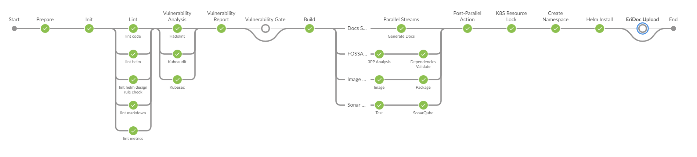
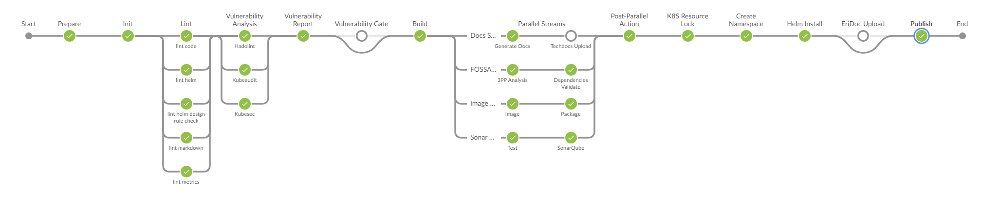

# [Go Golden Stages](https://eteamspace.internal.ericsson.com/display/DGBase/2.+Go+Golden+Stages)

### Page Description

----------

-   Purpose: This page outlines the golden stages executed in the  **Go hybrid microservice CI pipelines**.
-   Intended audience: Users of Go microservices pipelines on [fem6s11-eiffel216](https://fem6s11-eiffel216.eiffel.gic.ericsson.se:8443/jenkins/).
-   Reading time: ¬ 15 mins

  

### PCR Pipeline - Golden stages

----------

-   Sample job:  [eric-oss-go-template-microservice_PreCodeReview_Hybrid](https://fem6s11-eiffel216.eiffel.gic.ericsson.se:8443/jenkins/job/eric-oss-go-template-microservice_PreCodeReview_Hybrid/)

 

**[Prepare](https://gerrit.ericsson.se/plugins/gitiles/OSS/com.ericsson.oss.ci/oss-common-ci-utils/+/83f310bde117041186a22a971db165594eeed72d/dsl/jenkinsFiles/go_precodereview.Jenkinsfile#24)**

Prepares the pipeline for execution.

-   deleteDir()  → deletes previous build's artifacts and cleans the Jenkins workspace.
-   ci_pipeline_init.clone_project()  → clones your Gerrit repository and checks out your change.
-   ci_pipeline_init.clone_ci_repo()  → clones Hummingbirds' [CI repository](https://gerrit.ericsson.se/plugins/gitiles/OSS/com.ericsson.oss.ci/oss-common-ci-utils/+/refs/heads/dVersion-2.0.0-hybrid) and pulls down the [centrally managed files](https://eteamspace.internal.ericsson.com/display/DGBase/6.+Key+files+of+the+Hybrid+MS+CI+Pipeline+solution)  required for the pipeline execution.
-   ci_pipeline_init.setEnvironmentVariables()  → reads the "ci/local_pipeline_env.txt" file from your repository and sets them as environment variables.
-   ci_pipeline_init.setBuildName()  → sets the build name to #build_number/commit_author.
-   ${bob} --help  → prints bob usage guidelines.
-   ${bob} -lq  → inspects if the bob rules are correctly formatted.

  

Code References

**Code References**:

-   Jenkinsfile: [go_precodereview.Jenkinsfile](https://gerrit.ericsson.se/plugins/gitiles/OSS/com.ericsson.oss.ci/oss-common-ci-utils/+/83f310bde117041186a22a971db165594eeed72d/dsl/jenkinsFiles/go_precodereview.Jenkinsfile#24)
-   For definitions of the library methods, please refer to [ci_pipeline_init.groovy](https://gerrit.ericsson.se/plugins/gitiles/OSS/com.ericsson.oss.ci/oss-common-ci-utils/+/refs/heads/dVersion-2.0.0-hybrid/vars/ci_pipeline_init.groovy).

**[Init](https://gerrit.ericsson.se/plugins/gitiles/OSS/com.ericsson.oss.ci/oss-common-ci-utils/+/6c55cad4b1b9b7f80510e21663168e99adc1782b/dsl/jenkinsFiles/go_precodereview.Jenkinsfile#39)**

Initializes Bob variables.

-   ${bob} init-precodereview
    -   Generates a version based on the VERSION_PREFIX file.
    -   Generates commit hash (short), commit hash (full), and commit author variables.
    -   Generates image repository variables.
    -   Generates helm repository variables.
    -   The generated variables are stored in the ".bob/" directory in the Jenkins workspace.
    -   Performs additional tasks.
        -   Creates "build/" directory in the Jenkins workspace.
        -   Updates the VERSION in "config/eridoc_config.yaml" with the generated version.
    -   More info here
        

  

Code References

**Code References**:

-   Jenkinsfile: [go_precodereview.Jenkinsfile](https://gerrit.ericsson.se/plugins/gitiles/OSS/com.ericsson.oss.ci/oss-common-ci-utils/+/6c55cad4b1b9b7f80510e21663168e99adc1782b/dsl/jenkinsFiles/go_precodereview.Jenkinsfile#39)
-   Bob ruleset: [go_ruleset2.0.yaml](https://gerrit.ericsson.se/plugins/gitiles/OSS/com.ericsson.oss.ci/oss-common-ci-utils/+/6c55cad4b1b9b7f80510e21663168e99adc1782b/dsl/rulesetFiles/go_ruleset2.0.yaml#270)

Additional Info

**Additional Info**:

-   The environment variable "INIT_ENABLED" allows you to enable or disable this stage.
    -   To enable the stage, set "INIT_ENABLED=true" in your ci/local_pipeline_env.txt file.
    -   To disable the stage, set "INIT_ENABLED=false" in your ci/local_pipeline_env.txt file.
-   The custom stage marker "stage-marker-init" allows you to introduce custom pipeline stages.

**[Lint](https://gerrit.ericsson.se/plugins/gitiles/OSS/com.ericsson.oss.ci/oss-common-ci-utils/+/6c55cad4b1b9b7f80510e21663168e99adc1782b/dsl/jenkinsFiles/go_precodereview.Jenkinsfile#51)**

Performs static code analysis on the codebase and flags programming and stylistic errors.

-   ${bob} lint:golang
    -   Go source code lint.
    -   Uses ADP's gobuilder image "armdocker.rnd.ericsson.se/proj-adp-cicd-drop/bob-gobuilder.adp-base-os".
    -   Requires a config file in the "config" directory. (e.g. [.golangci.yml](https://gerrit.ericsson.se/plugins/gitiles/OSS/com.ericsson.oss.internaltools/eric-oss-go-template-microservice/+/refs/heads/master/.golangci.yml))
    -   Generates an output report (go-checkstyle.xml) in the "build/go-lint" directory in the Jenkins workspace.
-   ${bob} lint:helm
    -   Performs [helm lint](https://helm.sh/docs/helm/helm_lint/) on the helm chart.
    -   Uses ADP's docker image "armdocker.rnd.ericsson.se/proj-adp-cicd-drop/common-library-adp-helm-dr-check".
-   ${bob} lint:helm-dr-check
    -   Validates compliance with ADP helm design rules.
    -   Uses ADP's docker image "armdocker.rnd.ericsson.se/proj-adp-cicd-drop/common-library-adp-helm-dr-check".
    -   Generates design rule check reports in the "build/helm-dr-check" directory in the Jenkins workspace.
-   ${bob} lint:markdownlint lint:vale
    -   Documentation lint for markdown files.
    -   For more information on the markdown lint rules, please refer to  [RULES.md](https://github.com/markdownlint/markdownlint/blob/main/docs/RULES.md).
    -   This stage is set to always pass. Please refer to the console logs and fix the identified errors.
-   ${bob} lint:metrics-check
    -   Inspects the helm template YAML files (values.yaml, service.yaml, deployment.yaml, helpers.tpl) to ensure the lines required for Prometheus metrics exposure are included.
    -   If the required definitions are not found, the checker prints an error message (outlines the missing lines) and fails the pipeline.
    -   Requires [metrics-checker.sh](https://gerrit.ericsson.se/plugins/gitiles/OSS/com.ericsson.oss.internaltools/eric-oss-go-template-microservice/+/refs/heads/master/ci/scripts/metrics-checker.sh) script in the "ci/scripts" directory in the Gerrit repository.
    -   For more information on how to include metrics in a microservice, please refer to  [How to add metrics to a microservice](https://eteamspace.internal.ericsson.com/display/ESO/How+to+add+metrics+to+a+microservice).

  

Code References

**Code References**:

-   Jenkinsfile: [go_precodereview.Jenkinsfile](https://gerrit.ericsson.se/plugins/gitiles/OSS/com.ericsson.oss.ci/oss-common-ci-utils/+/6c55cad4b1b9b7f80510e21663168e99adc1782b/dsl/jenkinsFiles/go_precodereview.Jenkinsfile#51)
-   Bob ruleset: [go_ruleset2.0.yaml](https://gerrit.ericsson.se/plugins/gitiles/OSS/com.ericsson.oss.ci/oss-common-ci-utils/+/6c55cad4b1b9b7f80510e21663168e99adc1782b/dsl/rulesetFiles/go_ruleset2.0.yaml#321)
-   DR Exemption user guide:  [9. Design rule (DR) Exemption handling](https://eteamspace.internal.ericsson.com/display/DGBase/9.+Design+rule+%28DR%29+Exemption+handling)

Additional Info

**Additional Info**:

-   The environment variable "LINT_ENABLED" allows you to enable or disable this stage.
    -   To enable the stage, set "LINT_ENABLED=true" in your ci/local_pipeline_env.txt file.
    -   To disable the stage, set "LINT_ENABLED=false" in your ci/local_pipeline_env.txt file.

**[Vulnerability Analysis](https://gerrit.ericsson.se/plugins/gitiles/OSS/com.ericsson.oss.ci/oss-common-ci-utils/+/6c55cad4b1b9b7f80510e21663168e99adc1782b/dsl/jenkinsFiles/go_precodereview.Jenkinsfile#83)**

Three vulnerability analysis scan tools are run in parallel to analyze vulnerabilities in the codebase.

-   ${bob} hadolint-scan
    -   Dockerfile linter
    -   Requires a config file in the "config" directory. (e.g. [hadolint_config.yaml](https://gerrit.ericsson.se/plugins/gitiles/OSS/com.ericsson.oss.internaltools/eric-oss-go-template-microservice/+/refs/heads/master/config/hadolint_config.yaml))
    -   Generates output reports in the "build/va-reports/hadolint-reports" directory in the Jenkins workspace.
    -   The environment variable "HADOLINT_ENABLED" allows you to enable or disable this particular scan.
    -   For more information on the tool, please refer to [https://eteamspace.internal.ericsson.com/display/ACD/Hadolint](https://eteamspace.internal.ericsson.com/display/ACD/Hadolint).
-   ${bob} kubeaudit-scan
    -   Audits Kubernetes clusters for security concerns.
    -   Requires a config file in the "config" directory. (e.g. [kubeaudit_config.yaml](https://gerrit.ericsson.se/plugins/gitiles/OSS/com.ericsson.oss.internaltools/eric-oss-go-template-microservice/+/refs/heads/master/config/kubeaudit_config.yaml))
    -   Generates output reports in the "build/va-reports/kubeaudit-reports" directory in the Jenkins workspace.
    -   The environment variable "KUBEAUDIT_ENABLED" allows you to enable or disable this particular scan.
    -   For more information on the tool, please refer to [https://eteamspace.internal.ericsson.com/display/ACD/KubeAudit+Scanning](https://eteamspace.internal.ericsson.com/display/ACD/KubeAudit+Scanning).
-   ${bob} kubesec-scan
    -   Analyses for Kubernetes resources (helm template YAML files) for security risks.
    -   Requires a config file in the "config" directory. (e.g. [kubesec_config.yaml](https://gerrit.ericsson.se/plugins/gitiles/OSS/com.ericsson.oss.internaltools/eric-oss-go-template-microservice/+/refs/heads/master/config/kubesec_config.yaml))
    -   Generates output reports in the "build/va-reports/kubesec-reports" directory in the Jenkins workspace.
    -   The environment variable "KUBESEC_ENABLED" allows you to enable or disable this particular scan.
    -   For more information on the tool, please refer to [https://eteamspace.internal.ericsson.com/display/ACD/Kubesec+Scanning](https://eteamspace.internal.ericsson.com/display/ACD/Kubesec+Scanning).

  

Code References / User Guides

**Code References / User Guides**:

-   Jenkinsfile: [go_precodereview.Jenkinsfile](https://gerrit.ericsson.se/plugins/gitiles/OSS/com.ericsson.oss.ci/oss-common-ci-utils/+/6c55cad4b1b9b7f80510e21663168e99adc1782b/dsl/jenkinsFiles/go_precodereview.Jenkinsfile#83)
-   Bob ruleset: [go_ruleset2.0.yaml](https://gerrit.ericsson.se/plugins/gitiles/OSS/com.ericsson.oss.ci/oss-common-ci-utils/+/6c55cad4b1b9b7f80510e21663168e99adc1782b/dsl/rulesetFiles/go_ruleset2.0.yaml#756)
-   Hummingbirds' Vulnerability Analysis User Guide:  [4. Vulnerability Analysis Tools User Guide](https://eteamspace.internal.ericsson.com/display/DGBase/4.+Vulnerability+Analysis+Tools+User+Guide)
-   ADP's confluence pages:
    -   Vulnerability analysis:  [https://eteamspace.internal.ericsson.com/x/Gk6hQw](https://eteamspace.internal.ericsson.com/x/Gk6hQw)
    -   Hadolint: [https://eteamspace.internal.ericsson.com/x/n1yhQw](https://eteamspace.internal.ericsson.com/x/n1yhQw)
    -   Kubeaudit: [https://eteamspace.internal.ericsson.com/x/wE_hQw](https://eteamspace.internal.ericsson.com/x/wE_hQw)
    -   Kubesec:  [https://eteamspace.internal.ericsson.com/x/OFOhQw](https://eteamspace.internal.ericsson.com/x/OFOhQw)

Additional Info

**Additional Info**:

-   The environment variable "VA_ENABLED" allows you to enable or disable this stage.
    -   To enable the stage, set "VA_ENABLED=true" in your ci/local_pipeline_env.txt file.
        -   However, you can enable or disable a particular scan tool using the HADOLINT_ENABLED, KUBEAUDIT_ENABLED and KUBESEC_ENABLED variables.
    -   To disable the stage (along with all three scans), set "VA_ENABLED=false" in your ci/local_pipeline_env.txt file.

**[Vulnerability Report](https://gerrit.ericsson.se/plugins/gitiles/OSS/com.ericsson.oss.ci/oss-common-ci-utils/+/6c55cad4b1b9b7f80510e21663168e99adc1782b/dsl/jenkinsFiles/go_precodereview.Jenkinsfile#125)**

Generates consolidated reports using the scan reports from Hadolint, Kubeaudit and Kubesec scans.

-   ${bob} generate-va-report-v2:no-upload
    -   Generates a .md report (vulnerability_report_2.0.md) in the "build/va-reports" directory in the Jenkins workspace.
    -   Requires a config file in the "config" directory. (e.g. [va_report.config](https://gerrit.ericsson.se/plugins/gitiles/OSS/com.ericsson.oss.internaltools/eric-oss-go-template-microservice/+/refs/heads/master/config/va_report.config))
-   ${bob} generate-readable-va-report
    -   Generates a .html report (vulnerability_report_2.0.html) in the "build/va-reports/readable-va-report" directory in the Jenkins workspace.
    -   Requires a config file in the "config" directory. (e.g.  [va_readable_report_config.yaml](https://gerrit.ericsson.se/plugins/gitiles/OSS/com.ericsson.oss.internaltools/eric-oss-go-template-microservice/+/refs/heads/master/config/va_readable_report_config.yaml))

** Please refer to the generated reports and fix any identified vulnerabilities.

  

Code References / User Guides

**Code References / User Guides**:

-   Jenkinsfile: [go_precodereview.Jenkinsfile](https://gerrit.ericsson.se/plugins/gitiles/OSS/com.ericsson.oss.ci/oss-common-ci-utils/+/6c55cad4b1b9b7f80510e21663168e99adc1782b/dsl/jenkinsFiles/go_precodereview.Jenkinsfile#125)
-   Bob ruleset: [go_ruleset2.0.yaml](https://gerrit.ericsson.se/plugins/gitiles/OSS/com.ericsson.oss.ci/oss-common-ci-utils/+/6c55cad4b1b9b7f80510e21663168e99adc1782b/dsl/rulesetFiles/go_ruleset2.0.yaml#837)
-   Vulnerability Analysis User Guide:  [4. Vulnerability Analysis Tools User Guide](https://eteamspace.internal.ericsson.com/display/DGBase/4.+Vulnerability+Analysis+Tools+User+Guide)
-   ADP VA report automation:  [https://eteamspace.internal.ericsson.com/x/YlqhQw](https://eteamspace.internal.ericsson.com/x/YlqhQw)

Additional Info

**Additional Info**:

-   The environment variable "VA_REPORT_GENERATE_ENABLED" allows you to enable or disable this stage.
    -   To enable the stage, set "VA_REPORT_GENERATE_ENABLED=true" in your ci/local_pipeline_env.txt file.
    -   To disable the stage, set "VA_REPORT_GENERATE_ENABLED=false" in your ci/local_pipeline_env.txt file.
-   The custom stage marker "stage-marker-va-report" allows you to introduce custom pipeline stages.

**[Vulnerability Gate](https://gerrit.ericsson.se/plugins/gitiles/OSS/com.ericsson.oss.ci/oss-common-ci-utils/+/6c55cad4b1b9b7f80510e21663168e99adc1782b/dsl/jenkinsFiles/go_precodereview.Jenkinsfile#142)**

-   ${bob} gate-vulnerabilities
    -   Inspects the vulnerability reports for major and critical vulnerabilities, if found, fails the pipeline.
    -   This stage is enabled by default. You can disable the stage if it is blocking you from delivering code.

** We strongly recommend you enable this stage and fix any identified vulnerabilities.

  

Code References / User Guides

**Code References / User Guides**:

-   Jenkinsfile: [go_precodereview.Jenkinsfile](https://gerrit.ericsson.se/plugins/gitiles/OSS/com.ericsson.oss.ci/oss-common-ci-utils/+/6c55cad4b1b9b7f80510e21663168e99adc1782b/dsl/jenkinsFiles/go_precodereview.Jenkinsfile#142)
-   Bob ruleset: [go_ruleset2.0.yaml](https://gerrit.ericsson.se/plugins/gitiles/OSS/com.ericsson.oss.ci/oss-common-ci-utils/+/6c55cad4b1b9b7f80510e21663168e99adc1782b/dsl/rulesetFiles/go_ruleset2.0.yaml#882)
-   Vulnerability Analysis User Guide:  [4. Vulnerability Analysis Tools User Guide](https://eteamspace.internal.ericsson.com/display/DGBase/4.+Vulnerability+Analysis+Tools+User+Guide)
-   ADP VA report automation:  [https://eteamspace.internal.ericsson.com/x/YlqhQw](https://eteamspace.internal.ericsson.com/x/YlqhQw)

Additional Info

**Additional Info**:

-   The environment variable "VA_GATE_ENABLED " allows you to enable or disable this stage.
    -   To enable the stage, set "VA_GATE_ENABLED =true" in your ci/local_pipeline_env.txt file.
    -   To disable the stage, set "VA_GATE_ENABLED =false" in your ci/local_pipeline_env.txt file.
-   The custom stage marker "stage-marker-va-gate" allows you to introduce custom pipeline stages.

**[Build](https://gerrit.ericsson.se/plugins/gitiles/OSS/com.ericsson.oss.ci/oss-common-ci-utils/+/6c55cad4b1b9b7f80510e21663168e99adc1782b/dsl/jenkinsFiles/go_precodereview.Jenkinsfile#156)**

Builds source code.

-   ${bob} build
    -   Prints the version of Go used in the go-builder image "armdocker.rnd.ericsson.se/proj-adp-cicd-drop/bob-gobuilder.adp-base-os".
    -   Builds the Go source code and creates a binary in the "build/go-binary" directory in the Jenkins workspace.
    -   Note: This rule expects "go-docker-params" in the [common-properties.yaml](https://gerrit.ericsson.se/plugins/gitiles/OSS/com.ericsson.oss.internaltools/eric-oss-go-template-microservice/+/refs/heads/master/common-properties.yaml).

  

Code References

**Code References**:

-   Jenkinsfile: [go_precodereview.Jenkinsfile](https://gerrit.ericsson.se/plugins/gitiles/OSS/com.ericsson.oss.ci/oss-common-ci-utils/+/6c55cad4b1b9b7f80510e21663168e99adc1782b/dsl/jenkinsFiles/go_precodereview.Jenkinsfile#156)
-   Bob ruleset: [go_ruleset2.0.yaml](https://gerrit.ericsson.se/plugins/gitiles/OSS/com.ericsson.oss.ci/oss-common-ci-utils/+/6c55cad4b1b9b7f80510e21663168e99adc1782b/dsl/rulesetFiles/go_ruleset2.0.yaml#367)

Additional Info

**Additional Info**:

-   The environment variable "BUILD_ENABLED " allows you to enable or disable this stage.
    -   To enable the stage, set "BUILD_ENABLED=true" in your ci/local_pipeline_env.txt file.
    -   To disable the stage, set "BUILD_ENABLED=false" in your ci/local_pipeline_env.txt file.
-   The custom stage marker "stage-marker-build" allows you to introduce custom pipeline stages.

**[Generate Docs](https://gerrit.ericsson.se/plugins/gitiles/OSS/com.ericsson.oss.ci/oss-common-ci-utils/+/6c55cad4b1b9b7f80510e21663168e99adc1782b/dsl/jenkinsFiles/go_precodereview.Jenkinsfile#174)**

Prepares documents for Marketplace upload.

-   ${bob} generate-docs
    -   Converts the .adoc files in the "doc" directory to .sdif documents.
    -   Converts the .sdif to .html documents and zips them in the "build/docs" directory in the Jenkins workspace.
    -   These documents can be uploaded to the marketplace.

  

Code References

**Code References**:

-   Jenkinsfile: [go_precodereview.Jenkinsfile](https://gerrit.ericsson.se/plugins/gitiles/OSS/com.ericsson.oss.ci/oss-common-ci-utils/+/6c55cad4b1b9b7f80510e21663168e99adc1782b/dsl/jenkinsFiles/go_precodereview.Jenkinsfile#174)
-   Bob ruleset: [go_ruleset2.0.yaml](https://gerrit.ericsson.se/plugins/gitiles/OSS/com.ericsson.oss.ci/oss-common-ci-utils/+/6c55cad4b1b9b7f80510e21663168e99adc1782b/dsl/rulesetFiles/go_ruleset2.0.yaml#355)

Additional Info

**Additional Info**:

-   The environment variable "GENERATE_ENABLED" allows you to enable or disable this stage.
    -   To enable the stage, set "GENERATE_ENABLED=true" in your ci/local_pipeline_env.txt file.
    -   To disable the stage, set "GENERATE_ENABLED=false" in your ci/local_pipeline_env.txt file.
-   The custom stage marker "stage-marker-generate" allows you to introduce custom pipeline stages.

**[Techdocs Upload](https://gerrit.ericsson.se/plugins/gitiles/OSS/com.ericsson.oss.ci/oss-common-ci-utils/+/89fbfb08e0bdbe76742ed9e3cf2b0491948c29e2/dsl/jenkinsFiles/go_precodereview.Jenkinsfile#186)**

Performs a dry-run of Techdocs Upload to the NM Internal Developer Portal.

-   ${bob} techdocs-upload-dry-run
    -   Retrieves the entity name and kind from the catalog-info.yaml file.
    -   Checks connectivity with object storage endpoint.
    -   Generates techdocs using the mkdocs.yml file.

  

Code References / User Guides

**Code References / User Guides**:

-   Jenkinsfile: [go_precodereview.Jenkinsfile](https://gerrit.ericsson.se/plugins/gitiles/OSS/com.ericsson.oss.ci/oss-common-ci-utils/+/89fbfb08e0bdbe76742ed9e3cf2b0491948c29e2/dsl/jenkinsFiles/go_precodereview.Jenkinsfile#186)
-   Bob ruleset: [go_ruleset2.0.yaml](https://gerrit.ericsson.se/plugins/gitiles/OSS/com.ericsson.oss.ci/oss-common-ci-utils/+/89fbfb08e0bdbe76742ed9e3cf2b0491948c29e2/dsl/rulesetFiles/go_ruleset2.0.yaml#1026)
-   Techdocs Upload User Guide: [18. IDP Techdocs Upload](https://eteamspace.internal.ericsson.com/display/DGBase/18.+IDP+Techdocs+Upload)

Additional Info

**Additional Info**:

-   The environment variable "TECHDOCS_UPLOAD_ENABLED" allows you to enable or disable this stage.
    -   To enable the stage, set "TECHDOCS_UPLOAD_ENABLED=true" in your ci/local_pipeline_env.txt file.
    -   To disable the stage, set "TECHDOCS_UPLOAD_ENABLED=false" in your ci/local_pipeline_env.txt file.
-   The custom stage marker "stage-marker-techdocs" allows you to introduce custom pipeline stages.

**[Test](https://gerrit.ericsson.se/plugins/gitiles/OSS/com.ericsson.oss.ci/oss-common-ci-utils/+/6c55cad4b1b9b7f80510e21663168e99adc1782b/dsl/jenkinsFiles/go_precodereview.Jenkinsfile#190)**

Runs unit tests.

-   ${bob} test
    -   Executes unit tests
    -   Generates a coverage report (cover.out) in the Jenkins workspace.
    -   Note: This coverage report is required for SonarQube analysis.

  

Code References

**Code References**:

-   Jenkinsfile: [go_precodereview.Jenkinsfile](https://gerrit.ericsson.se/plugins/gitiles/OSS/com.ericsson.oss.ci/oss-common-ci-utils/+/6c55cad4b1b9b7f80510e21663168e99adc1782b/dsl/jenkinsFiles/go_precodereview.Jenkinsfile#190)
-   Bob ruleset: [go_ruleset2.0.yaml](https://gerrit.ericsson.se/plugins/gitiles/OSS/com.ericsson.oss.ci/oss-common-ci-utils/+/6c55cad4b1b9b7f80510e21663168e99adc1782b/dsl/rulesetFiles/go_ruleset2.0.yaml#382)

Additional Info

**Additional Info**:

-   The environment variable "TEST_ENABLED" allows you to enable or disable this stage.
    -   To enable the stage, set "TEST_ENABLED=true" in your ci/local_pipeline_env.txt file.
    -   To disable the stage, set "TEST_ENABLED=false" in your ci/local_pipeline_env.txt file.
-   The custom stage marker "stage-marker-test" allows you to introduce custom pipeline stages.

**[SonarQube](https://gerrit.ericsson.se/plugins/gitiles/OSS/com.ericsson.oss.ci/oss-common-ci-utils/+/6c55cad4b1b9b7f80510e21663168e99adc1782b/dsl/jenkinsFiles/go_precodereview.Jenkinsfile#204)**

Runs SonarQube analysis.

-   ${bob} sonar-enterprise-pcr
    -   Runs SonarQube analysis on the patch set pushed to the master branch.
    -   Requires a sonar properties file. (e.g.  [sonar-project.properties](https://gerrit.ericsson.se/plugins/gitiles/OSS/com.ericsson.oss.internaltools/eric-oss-go-template-microservice/+/refs/heads/master/sonar-project.properties))
    -   SonarQube quality profile used: [Sonar way (Go)](https://codeanalyzer2.internal.ericsson.com/profiles/show?name=Sonar+way&language=go).
    -   SonarQube quality gate used: [Sonar way ENM](https://codeanalyzer2.internal.ericsson.com/quality_gates/show/AWtILjyUQhEz8Exro8Aj).
    -   Note: You need 90% of code coverage for the quality gate to pass.
    -   For more information on SonarQube, please refer to the  [SonarQube overview](https://eteamspace.internal.ericsson.com/display/CICDP/SonarQube+overview).
-   ci_pipeline_scripts.goSonarQualityGate()
    -   Gets the quality gate status.
    -   If the quality gate passes, an automated Gerrit feedback of "SQ-Quality-Gate +1" is given to the Gerrit patch.
    -   If the quality gate fails, an automated Gerrit feedback of "SQ-Quality-Gate -1" is given to the Gerrit patch, and the pipeline execution is terminated.
        -   Please refer to the SonarQube dashboard (URL in the console logs) and fix any identified code smells or insufficient code coverage.

  

Code References

**Code References**:

-   Jenkinsfile: [go_precodereview.Jenkinsfile](https://gerrit.ericsson.se/plugins/gitiles/OSS/com.ericsson.oss.ci/oss-common-ci-utils/+/6c55cad4b1b9b7f80510e21663168e99adc1782b/dsl/jenkinsFiles/go_precodereview.Jenkinsfile#204)
-   Bob ruleset: [go_ruleset2.0.yaml](https://gerrit.ericsson.se/plugins/gitiles/OSS/com.ericsson.oss.ci/oss-common-ci-utils/+/6c55cad4b1b9b7f80510e21663168e99adc1782b/dsl/rulesetFiles/go_ruleset2.0.yaml#391)
-   For definition of the library method  ci_pipeline_scripts.goSonarQualityGate(), please refer to  [ci_pipeline_scripts.groovy](https://gerrit.ericsson.se/plugins/gitiles/OSS/com.ericsson.oss.ci/oss-common-ci-utils/+/refs/heads/dVersion-2.0.0-hybrid/vars/ci_pipeline_scripts.groovy)

Additional Info

**Additional Info**:

-   The environment variable "SQ_LOCAL_ENABLED" allows you to enable or disable this stage.
    -   To enable the stage, set "SQ_LOCAL_ENABLED=true" in your ci/local_pipeline_env.txt file.
    -   To disable the stage, set "SQ_LOCAL_ENABLED=false" in your ci/local_pipeline_env.txt file.

**[Image](https://gerrit.ericsson.se/plugins/gitiles/OSS/com.ericsson.oss.ci/oss-common-ci-utils/+/6c55cad4b1b9b7f80510e21663168e99adc1782b/dsl/jenkinsFiles/go_precodereview.Jenkinsfile#232)**

Builds docker image and validates ADP Image design rules.

-   ${bob} image
    -   Builds a Docker image using the Dockerfile from your Gerrit repository.
        
    -   The Docker image is tagged with the format: "armdocker.rnd.ericsson.se/proj-eric-oss-ci-internal/<artifact_id>:<version>"
        
        -   For instance, "armdocker.rnd.ericsson.se/proj-eric-oss-ci-internal/eric-oss-go-template-microservice:1.0.0-f167b37".
            
    -   More info here
        
-   ${bob} image-dr-check
    -   Validates compliance with ADP docker image design rules.
    -   Generates design rule check reports in the "build/image-dr-check" directory in the Jenkins workspace.

  

Code References

**Code References**:

-   Jenkinsfile: [go_precodereview.Jenkinsfile](https://gerrit.ericsson.se/plugins/gitiles/OSS/com.ericsson.oss.ci/oss-common-ci-utils/+/6c55cad4b1b9b7f80510e21663168e99adc1782b/dsl/jenkinsFiles/go_precodereview.Jenkinsfile#232)
-   Bob ruleset: [go_ruleset2.0.yaml](https://gerrit.ericsson.se/plugins/gitiles/OSS/com.ericsson.oss.ci/oss-common-ci-utils/+/6c55cad4b1b9b7f80510e21663168e99adc1782b/dsl/rulesetFiles/go_ruleset2.0.yaml#420)

Additional Info

**Additional Info**:

-   The environment variable "IMAGE_ENABLED" allows you to enable or disable this stage.
    -   To enable the stage, set "IMAGE_ENABLED=true" in your ci/local_pipeline_env.txt file.
    -   To disable the stage, set "IMAGE_ENABLED=false" in your ci/local_pipeline_env.txt file.
-   The custom stage marker "stage-marker-image" allows you to introduce custom pipeline stages.

**[Package](https://gerrit.ericsson.se/plugins/gitiles/OSS/com.ericsson.oss.ci/oss-common-ci-utils/+/6c55cad4b1b9b7f80510e21663168e99adc1782b/dsl/jenkinsFiles/go_precodereview.Jenkinsfile#252)**

Uploads docker image and helm chart to artifactory.

-   ${bob} package
    -   Pushes the newly built docker image to [proj-eric-oss-ci-internal](https://arm.seli.gic.ericsson.se/artifactory/proj-eric-oss-ci-internal-docker-global/proj-eric-oss-ci-internal/).
    -   Packages the helm chart in the ".bob" directory in the Jenkins workspace
    -   Uploads the packaged helm chart to [proj-eric-oss-ci-internal-helm-local](https://arm.seli.gic.ericsson.se/artifactory/proj-eric-oss-ci-internal-helm-local/).
    -   You can find the artifactory links specific to your project in your Jenkins job's description.

  

Code References

**Code References**:

-   Jenkinsfile: [go_precodereview.Jenkinsfile](https://gerrit.ericsson.se/plugins/gitiles/OSS/com.ericsson.oss.ci/oss-common-ci-utils/+/6c55cad4b1b9b7f80510e21663168e99adc1782b/dsl/jenkinsFiles/go_precodereview.Jenkinsfile#252)
-   Bob ruleset: [go_ruleset2.0.yaml](https://gerrit.ericsson.se/plugins/gitiles/OSS/com.ericsson.oss.ci/oss-common-ci-utils/+/6c55cad4b1b9b7f80510e21663168e99adc1782b/dsl/rulesetFiles/go_ruleset2.0.yaml#452)

Additional Info

**Additional Info**:

-   The environment variable "PACKAGE_ENABLED" allows you to enable or disable this stage.
    -   To enable the stage, set "PACKAGE_ENABLED=true" in your ci/local_pipeline_env.txt file.
    -   To disable the stage, set "PACKAGE_ENABLED=false" in your ci/local_pipeline_env.txt file.
-   The custom stage marker "stage-marker-package" allows you to introduce custom pipeline stages.

**[3PP Analysis](https://gerrit.ericsson.se/plugins/gitiles/OSS/com.ericsson.oss.ci/oss-common-ci-utils/+/6c55cad4b1b9b7f80510e21663168e99adc1782b/dsl/jenkinsFiles/go_precodereview.Jenkinsfile#276)**

Runs FOSSA scan.

-   ${bob} 3pp-analysis
    -   fossa-analyze
        -   Initializes your FOSSA project in the [FOSSA server](https://scasfossa.internal.ericsson.com/projects).
        -   Scans the 3PP dependencies in the [go.mod](https://gerrit.ericsson.se/plugins/gitiles/OSS/com.ericsson.oss.internaltools/eric-oss-go-template-microservice/+/refs/heads/master/go.mod) file.
        -   Uploads the scan results to FOSSA server.
        -   You can find project summary, issue dependencies, licenses and a series of vulnerability and compliance reports in the FOSSA server.
            -   Please note that you need a FOSSA team name for this step. For more info on how to order a FOSSA team name, please refer to  [11. FOSSA Scanning#11.FOSSAScanning-CreatingaFOSSATeam](https://eteamspace.internal.ericsson.com/display/DGBase/11.+FOSSA+Scanning#id-11.FOSSAScanning-11.FOSSAScanning-CreatingaFOSSATeam).
    -   fossa-scan-status-check  → Verifies if the FOSSA scan is successful.
    -   fetch-fossa-report-attribution
        -   Downloads the FOSSA report from the server and generates a JSON output (fossa-report.json) in the "build/fossa" directory in the Jenkins workspace.
        -   The fossa-report.json contains information about the dependencies and their licenses.
        -   This file is required to generate your "dependencies-3pp.yaml" file.
    -   dependencies-update  → Converts "fossa-report.json" into "dependencies-3pp.yaml" and fills any missing fields with SCAS data.
        -   Generates dependencies-3pp.yaml in the "build/fossa" directory in the Jenkins workspace.
        -   There will be a number of blank fields that need to be updated manually to link your dependencies to SCAS.
    -   dependencies-enrich  → Enriches the dependencies-3pp.yaml with information in the manually filled "config/dependencies-metadata.yaml" file.
    -   Please note this rule requires two config files in the "config" directory.
        -   (e.g. [dependencies-metadata.yaml](https://gerrit.ericsson.se/plugins/gitiles/OSS/com.ericsson.oss.internaltools/eric-oss-go-template-microservice/+/refs/heads/master/config/dependencies-metadata.yaml))
        -   (e.g. [dependencies-3pp.yaml](https://gerrit.ericsson.se/plugins/gitiles/OSS/com.ericsson.oss.internaltools/eric-oss-go-template-microservice/+/refs/heads/master/config/dependencies-3pp.yaml)) This file is generated during the FOSSA scan in the "build/fossa" directory in the Jenkins workspace.
            -   Please manually add this file to the "config" directory in your Gerrit repo.
    -   For more information on the FOSSA scan, please refer to the below User Guide.

  

Code References

**Code References**:

-   Jenkinsfile: [go_precodereview.Jenkinsfile](https://gerrit.ericsson.se/plugins/gitiles/OSS/com.ericsson.oss.ci/oss-common-ci-utils/+/6c55cad4b1b9b7f80510e21663168e99adc1782b/dsl/jenkinsFiles/go_precodereview.Jenkinsfile#276)
-   Bob ruleset: [go_ruleset2.0.yaml](https://gerrit.ericsson.se/plugins/gitiles/OSS/com.ericsson.oss.ci/oss-common-ci-utils/+/6c55cad4b1b9b7f80510e21663168e99adc1782b/dsl/rulesetFiles/go_ruleset2.0.yaml#655)
-   FOSSA User Guide:  [11. FOSSA Scanning](https://eteamspace.internal.ericsson.com/display/DGBase/11.+FOSSA+Scanning)
-   ADP FOSS Handling:  [https://eteamspace.internal.ericsson.com/display/ACD/FOSS+Handling+Instructions#FOSSHandlingInstructions-Validatedependencies.yaml](https://eteamspace.internal.ericsson.com/display/ACD/FOSS+Handling+Instructions#FOSSHandlingInstructions-Validatedependencies.yaml)

Additional Info

**Additional Info**:

-   The environment variable "FOSSA_ENABLED" allows you to enable or disable this stage.
    -   To enable the stage, set "FOSSA_ENABLED=true" in your ci/local_pipeline_env.txt file.
    -   To disable the stage, set "FOSSA_ENABLED=false" in your ci/local_pipeline_env.txt file.

**[Dependencies Validate](https://gerrit.ericsson.se/plugins/gitiles/OSS/com.ericsson.oss.ci/oss-common-ci-utils/+/6c55cad4b1b9b7f80510e21663168e99adc1782b/dsl/jenkinsFiles/go_precodereview.Jenkinsfile#289)**

Validates 3PP dependencies.

-   ${bob} dependencies-validate
    -   Validate the generated dependencies-3pp.yaml file and checks if all the mandatory attributes are filled.
    -   This scan is set always pass. Please refer to the console logs and fix any identified errors.
    -   For more information on dependency validation, please refer to  [11. FOSSA Scanning](https://eteamspace.internal.ericsson.com/display/DGBase/11.+FOSSA+Scanning).

  

Code References

**Code References**:

-   Jenkinsfile: [go_precodereview.Jenkinsfile](https://gerrit.ericsson.se/plugins/gitiles/OSS/com.ericsson.oss.ci/oss-common-ci-utils/+/6c55cad4b1b9b7f80510e21663168e99adc1782b/dsl/jenkinsFiles/go_precodereview.Jenkinsfile#289)
-   Bob ruleset: [go_ruleset2.0.yaml](https://gerrit.ericsson.se/plugins/gitiles/OSS/com.ericsson.oss.ci/oss-common-ci-utils/+/6c55cad4b1b9b7f80510e21663168e99adc1782b/dsl/rulesetFiles/go_ruleset2.0.yaml#704)

Additional Info

**Additional Info**:

-   The environment variable "FOSSA_ENABLED" allows you to enable or disable this stage.
    -   To enable the stage, set "FOSSA_ENABLED=true" in your ci/local_pipeline_env.txt file.
    -   To disable the stage, set "FOSSA_ENABLED=false" in your ci/local_pipeline_env.txt file.
-   The custom stage marker "stage-marker-fossa" allows you to introduce custom pipeline stages.

**[Post-Parallel Action](https://gerrit.ericsson.se/plugins/gitiles/OSS/com.ericsson.oss.ci/oss-common-ci-utils/+/6c55cad4b1b9b7f80510e21663168e99adc1782b/dsl/jenkinsFiles/go_precodereview.Jenkinsfile#312)**

Placeholder to load custom stages.

-   The custom stage marker "stage-marker-post-parallel" allows you to introduce custom pipeline stages.

  

Code References

**Code References**:

-   Jenkinsfile: [go_precodereview.Jenkinsfile](https://gerrit.ericsson.se/plugins/gitiles/OSS/com.ericsson.oss.ci/oss-common-ci-utils/+/6c55cad4b1b9b7f80510e21663168e99adc1782b/dsl/jenkinsFiles/go_precodereview.Jenkinsfile#312)

**[K8S Resource Lock](https://gerrit.ericsson.se/plugins/gitiles/OSS/com.ericsson.oss.ci/oss-common-ci-utils/+/6c55cad4b1b9b7f80510e21663168e99adc1782b/dsl/jenkinsFiles/go_precodereview.Jenkinsfile#318)**

Reserves namespace for Helm install.

-   Obtains a lock on one of the namespaces configured in the Jenkins server and reserves it for helm installation.
-   This prevents simultaneous usage of the same Kubernetes namespace by multiple builds.
-   The namespaces are reserved on the Kaas cluster "hahn134".

  

Code References

**Code References**:

-   Jenkinsfile: [go_precodereview.Jenkinsfile](https://gerrit.ericsson.se/plugins/gitiles/OSS/com.ericsson.oss.ci/oss-common-ci-utils/+/6c55cad4b1b9b7f80510e21663168e99adc1782b/dsl/jenkinsFiles/go_precodereview.Jenkinsfile#318)

**[Create Namespace](https://gerrit.ericsson.se/plugins/gitiles/OSS/com.ericsson.oss.ci/oss-common-ci-utils/+/6c55cad4b1b9b7f80510e21663168e99adc1782b/dsl/jenkinsFiles/go_precodereview.Jenkinsfile#327)**

Create a namespace in the Kubernetes cluster for Helm install.

-   ${bob} expand-helm-template
    -   Expands the helm template files in the ".bob/helm_src" directory in the Jenkins workspace.
-   ${bob} create-namespace
    -   Checks if the reserved namespace exists in the Kaas cluster.
    -   If it exists, the namespace is deleted and recreated.
-   This stage also injects the kube config file into the Jenkins workspace.

  

Code References

**Code References**:

-   Jenkinsfile: [go_precodereview.Jenkinsfile](https://gerrit.ericsson.se/plugins/gitiles/OSS/com.ericsson.oss.ci/oss-common-ci-utils/+/6c55cad4b1b9b7f80510e21663168e99adc1782b/dsl/jenkinsFiles/go_precodereview.Jenkinsfile#327)
-   Bob ruleset: [go_ruleset2.0.yaml](https://gerrit.ericsson.se/plugins/gitiles/OSS/com.ericsson.oss.ci/oss-common-ci-utils/+/6c55cad4b1b9b7f80510e21663168e99adc1782b/dsl/rulesetFiles/go_ruleset2.0.yaml#530)

Additional Info

**Additional Info**:

-   The environment variable "HELM_INSTALL_ENABLED" allows you to enable or disable this stage.
    -   To enable the stage, set "HELM_INSTALL_ENABLED=true" in your ci/local_pipeline_env.txt file.
    -   To disable the stage, set "HELM_INSTALL_ENABLED=false" in your ci/local_pipeline_env.txt file.
-   The custom stage marker "stage-marker-helm" allows you to introduce custom pipeline stages.

**[Helm Install](https://gerrit.ericsson.se/plugins/gitiles/OSS/com.ericsson.oss.ci/oss-common-ci-utils/+/6c55cad4b1b9b7f80510e21663168e99adc1782b/dsl/jenkinsFiles/go_precodereview.Jenkinsfile#343)**

Installs the microservice helm chart onto the Kubernetes cluster.

-   ${bob} helm-dry-run
    -   Performs a dry run and ensures the helm template files render as expected.
    -   Generates helm-install-dry-run.log in the "build/helm-install-logs" directory in the Jenkins workspace.
-   ${bob} helm-install
    -   Creates an image pull secret using the functional user's docker config.
    -   Installs the microservice's packaged helm chart (from the ".bob/" directory) in the reserved namespace.
    -   If the Helm install fails,  ${bob} collect-k8s-logs  → collects the Kubernetes logs (to help the developers with debugging).
        -   You can find the k8s-logs in the "build/helm-install-logs" directory in the Jenkins workspace.
    -   As a post condition,  ${bob} kaas-info  → collects the cluster info and generates a log file (kaas-info.log) in the "build/helm-install-logs" directory in the Jenkins workspace.
    -   Finally,  ${bob} delete-namespace  → deletes the reserved namespace and the lock on the namespace is released.

  

Code References

**Code References**:

-   Jenkinsfile: [go_precodereview.Jenkinsfile](https://gerrit.ericsson.se/plugins/gitiles/OSS/com.ericsson.oss.ci/oss-common-ci-utils/+/6c55cad4b1b9b7f80510e21663168e99adc1782b/dsl/jenkinsFiles/go_precodereview.Jenkinsfile#343)
-   Bob ruleset: [go_ruleset2.0.yaml](https://gerrit.ericsson.se/plugins/gitiles/OSS/com.ericsson.oss.ci/oss-common-ci-utils/+/6c55cad4b1b9b7f80510e21663168e99adc1782b/dsl/rulesetFiles/go_ruleset2.0.yaml#561)

Additional Info

**Additional Info**:

-   The environment variable "HELM_INSTALL_ENABLED" allows you to enable or disable this stage.
    -   To enable the stage, set "HELM_INSTALL_ENABLED=true" in your ci/local_pipeline_env.txt file.
    -   To disable the stage, set "HELM_INSTALL_ENABLED=false" in your ci/local_pipeline_env.txt file.
-   The custom stage marker "stage-marker-helm-post" allows you to introduce custom pipeline stages.

**[EriDoc Upload](https://gerrit.ericsson.se/plugins/gitiles/OSS/com.ericsson.oss.ci/oss-common-ci-utils/+/6c55cad4b1b9b7f80510e21663168e99adc1782b/dsl/jenkinsFiles/go_precodereview.Jenkinsfile#376)**

Performs Eridoc upload dry run.

-   ${bob} eridoc-upload:doc-to-pdf
    -   Converts the .md files specified in the "config/eridoc_docs_to_pdf_config.yaml" into .pdf files.
    -   Requires two config files in the "config/" directory. (e.g.  [eridoc_docs_to_pdf_config.yaml](https://gerrit.ericsson.se/plugins/gitiles/OSS/com.ericsson.oss.internaltools/eric-oss-go-template-microservice/+/refs/heads/master/config/eridoc_docs_to_pdf_config.yaml)  and [eridoc_stylesheet.css](https://gerrit.ericsson.se/plugins/gitiles/OSS/com.ericsson.oss.internaltools/eric-oss-go-template-microservice/+/refs/heads/master/config/eridoc_stylesheet.css))
-   ${bob} eridoc-upload:dry-run
    -   Performs dry-run to verify the Eridoc config "config/eridoc_config.yaml"
    -   Requires a config file in the "config/" directory (e.g.  [eridoc_config.yaml](https://gerrit.ericsson.se/plugins/gitiles/OSS/com.ericsson.oss.internaltools/eric-oss-go-template-microservice/+/refs/heads/master/config/eridoc_config.yaml))
    -   Please note that there are a few prerequisites that you need to fulfil for the Eridoc upload to work. For more info, please refer to the User guide linked below.

  

Code References/ User Guides

**Code References / User Guides**:

-   Jenkinsfile: [go_precodereview.Jenkinsfile](https://gerrit.ericsson.se/plugins/gitiles/OSS/com.ericsson.oss.ci/oss-common-ci-utils/+/6c55cad4b1b9b7f80510e21663168e99adc1782b/dsl/jenkinsFiles/go_precodereview.Jenkinsfile#376)
-   Bob ruleset: [go_ruleset2.0.yaml](https://gerrit.ericsson.se/plugins/gitiles/OSS/com.ericsson.oss.ci/oss-common-ci-utils/+/6c55cad4b1b9b7f80510e21663168e99adc1782b/dsl/rulesetFiles/go_ruleset2.0.yaml#894)
-   User guide:  [1. Eridoc Upload](https://eteamspace.internal.ericsson.com/display/DGBase/1.+Eridoc+Upload)

Additional Info

**Additional Info**:

-   The environment variable "ERIDOC_ENABLED" allows you to enable or disable this stage.
    -   -   To enable the stage, set "ERIDOC_ENABLED=true" in your ci/local_pipeline_env.txt file.
        -   To disable the stage, set "ERIDOC_ENABLED=false" in your ci/local_pipeline_env.txt file.
-   The custom stage marker "stage-marker-eridoc" allows you to introduce custom pipeline stages.

**[Declarative: Post Actions](https://gerrit.ericsson.se/plugins/gitiles/OSS/com.ericsson.oss.ci/oss-common-ci-utils/+/6c55cad4b1b9b7f80510e21663168e99adc1782b/dsl/jenkinsFiles/go_precodereview.Jenkinsfile#394)**

Once the pipeline execution is finished, this stage executes and performs the following actions.

-   ${bob} helm-dr-check-report-warnings  → inspects the design rule check report ".bob/design-rule-check-report.xml" for design rules with a WARNING verdict.
-   If any rules are found,  ci_pipeline_post.addHelmDRWarningIcon()  → adds a warning icon    to the Jenkins build.
-   [helm-dr-checker.py](https://gerrit.ericsson.se/plugins/gitiles/OSS/com.ericsson.oss.ci/oss-common-ci-utils/+/refs/heads/dVersion-2.0.0-hybrid/dsl/scripts/helm-dr-checker.py)  → validates microservices' compliance with ADP-enforced Helm design rules and generates a compliance report ".bob/design-rule-compliance-report.html" in the Jenkins workspace.
-   ci_pipeline_post.commonPostSteps()  → retrieves the build logs and artifacts, compresses them into a zip file, and uploads them to the artifactory repository [proj-eric-oss-ci-internal-build-artifacts-generic-local](https://arm.seli.gic.ericsson.se/artifactory/proj-eric-oss-ci-internal-build-artifacts-generic-local/).
-   ${bob} delete-images:delete-internal-image  → deletes the microservice docker image from the Jenkins agent.
-   Finally, the  ci_pipeline_post.modifyBuildDescription()  → adds the Helm design rule compliance data and links artifacts created during pipeline execution to the Jenkins build page.

  

Code References / User Guides

**Code References / User Guides**:

-   Jenkinsfile: [go_precodereview.Jenkinsfile](https://gerrit.ericsson.se/plugins/gitiles/OSS/com.ericsson.oss.ci/oss-common-ci-utils/+/6c55cad4b1b9b7f80510e21663168e99adc1782b/dsl/jenkinsFiles/go_precodereview.Jenkinsfile#394)
-   Bob ruleset: [go_ruleset2.0.yaml](https://gerrit.ericsson.se/plugins/gitiles/OSS/com.ericsson.oss.ci/oss-common-ci-utils/+/6c55cad4b1b9b7f80510e21663168e99adc1782b/dsl/rulesetFiles/go_ruleset2.0.yaml#987)
-   For definitions of the library methods, please refer to  [ci_pipeline_post.groovy](https://gerrit.ericsson.se/plugins/gitiles/OSS/com.ericsson.oss.ci/oss-common-ci-utils/+/refs/heads/dVersion-2.0.0-hybrid/vars/ci_pipeline_post.groovy).
-   For more info on build data consolidation, please refer to  [10. Build Data Consolidation Solution](https://eteamspace.internal.ericsson.com/display/DGBase/10.+Build+Data+Consolidation+Solution)

Additional Info

**Additional Info**:

-   The custom stage marker "stage-marker-post" allows you to introduce custom pipeline stages.

 

### Publish Pipeline - Golden stages

***Most stages in the Publish pipeline are the same as the PCR pipelines. A few stages (mentioned below) are either slightly different to the PCR pipeline or specific to publish pipelines.***

-   Sample job:  [eric-oss-go-template-microservice_Publish_Hybrid](https://fem6s11-eiffel216.eiffel.gic.ericsson.se:8443/jenkins/job/eric-oss-go-template-microservice_Publish_Hybrid/)

**[Init](https://gerrit.ericsson.se/plugins/gitiles/OSS/com.ericsson.oss.ci/oss-common-ci-utils/+/6c55cad4b1b9b7f80510e21663168e99adc1782b/dsl/jenkinsFiles/go_publish.Jenkinsfile#40)**

Initializes Bob variables.

-   ${bob} init-drop  
    -   Generates a version based on the VERSION_PREFIX file.
        -   The generated version follows the format "<version prefix>-<sequence number>". (e.g. "1.0.0-1")
    -   Generates Gerrit commit variables similar to PCR.
    -   Generates additional image repository variables specific to the drop repo (highlighted below).
    -   Generates additional helm repository variables specific to the drop repo (highlighted below).
    -   Generates artifact.properties for Spinnaker execution.
    -   More info here
        
        -   Image repository variables
            -   var.image-registry: Image registry to upload docker images. (e.g. "armdocker.rnd.ericsson.se")
            -   var.image-repopath-internal: The repository to upload docker images (e.g. "proj-eric-oss-ci-internal")
            -   var.image-repopath-drop: The repository to upload docker images in the Publish stage (e.g. "proj-eric-oss-drop")
            -   var.image-full-name-internal: The name of the docker image (e.g. "armdocker.rnd.ericsson.se/proj-eric-oss-ci-internal/eric-oss-go-template-microservice")
            -   var.image-full-name-drop: The name of the docker image (e.g. "armdocker.rnd.ericsson.se/proj-eric-oss-drop/eric-oss-go-template-microservice")
        -   Helm repository variables
            -   var.helm-repopath-internal: The helm repository to upload helm charts (e.g. "https://arm.seli.gic.ericsson.se/artifactory/proj-eric-oss-ci-internal-helm-local")
            -   var.helm-repopath-drop: The helm drop repository to upload helm charts (e.g. "https://arm.seli.gic.ericsson.se/artifactory/proj-eric-oss-drop-helm-local")
        

Code References

**Code References**:

-   Jenkinsfile: [go_publish.Jenkinsfile](https://gerrit.ericsson.se/plugins/gitiles/OSS/com.ericsson.oss.ci/oss-common-ci-utils/+/6c55cad4b1b9b7f80510e21663168e99adc1782b/dsl/jenkinsFiles/go_publish.Jenkinsfile#40)
-   Bob ruleset: [go_ruleset2.0.yaml](https://gerrit.ericsson.se/plugins/gitiles/OSS/com.ericsson.oss.ci/oss-common-ci-utils/+/6c55cad4b1b9b7f80510e21663168e99adc1782b/dsl/rulesetFiles/go_ruleset2.0.yaml#283)

**[Vulnerability Report](https://gerrit.ericsson.se/plugins/gitiles/OSS/com.ericsson.oss.ci/oss-common-ci-utils/+/6c55cad4b1b9b7f80510e21663168e99adc1782b/dsl/jenkinsFiles/go_publish.Jenkinsfile#127)**

Generates consolidated reports using the scan reports from Hadolint, Kubeaudit and Kubesec scans.

-   ${bob} generate-va-report-v2:upload  
    -   Generates a .md report (vulnerability_report_2.0.md) in the "build/va-reports" directory in the Jenkins workspace.
    -   Uploads the report to PSDAP.
    -   For more information on PSDAP, please refer to  [1. Generating VA Scan Report and Integration with EVMS & PSDAP User Guide](https://eteamspace.internal.ericsson.com/pages/viewpage.action?pageId=2019829361)
-   ${bob} generate-readable-va-report  → Same as PCR pipeline.

  

Code References / User Guides

**Code References / User Guides**:

-   Jenkinsfile: [go_publish.Jenkinsfile](https://gerrit.ericsson.se/plugins/gitiles/OSS/com.ericsson.oss.ci/oss-common-ci-utils/+/6c55cad4b1b9b7f80510e21663168e99adc1782b/dsl/jenkinsFiles/go_publish.Jenkinsfile#127)
-   Bob ruleset: [go_ruleset2.0.yaml](https://gerrit.ericsson.se/plugins/gitiles/OSS/com.ericsson.oss.ci/oss-common-ci-utils/+/6c55cad4b1b9b7f80510e21663168e99adc1782b/dsl/rulesetFiles/go_ruleset2.0.yaml#837)
-   Vulnerability Analysis User Guide:  [4. Vulnerability Analysis Tools User Guide](https://eteamspace.internal.ericsson.com/display/DGBase/4.+Vulnerability+Analysis+Tools+User+Guide)
-   ADP VA report automation:  [https://eteamspace.internal.ericsson.com/x/YlqhQw](https://eteamspace.internal.ericsson.com/x/YlqhQw)

Additional Info

**Additional Info**:

-   The environment variable "VA_REPORT_UPLOAD_ENABLED " allows you to enable or disable the upload step.
    -   To enable upload to VHUB, set "VA_REPORT_UPLOAD_ENABLED =true" in your ci/local_pipeline_env.txt file.
    -   To disable upload to VHUB, set "VA_REPORT_UPLOAD_ENABLED =false" in your ci/local_pipeline_env.txt file.
-   The custom stage marker "stage-marker-va-report" allows you to introduce custom pipeline stages.

**[Techdocs Upload](https://gerrit.ericsson.se/plugins/gitiles/OSS/com.ericsson.oss.ci/oss-common-ci-utils/+/89fbfb08e0bdbe76742ed9e3cf2b0491948c29e2/dsl/jenkinsFiles/go_publish.Jenkinsfile#194)**

Uploads Techdocs to the NM Internal Developer Portal.

-   ${bob} techdocs-upload
    -   Retrieves the entity name and kind from the catalog-info.yaml file.
    -   Checks connectivity with object storage endpoint.
    -   Generates techdocs using the mkdocs.yml file.
    -   Uploads documents to the NM Internal Developer Portal.

  

Code References / User Guides

**Code References / User Guides**:

-   Jenkinsfile: [go_publish.Jenkinsfile](https://gerrit.ericsson.se/plugins/gitiles/OSS/com.ericsson.oss.ci/oss-common-ci-utils/+/89fbfb08e0bdbe76742ed9e3cf2b0491948c29e2/dsl/jenkinsFiles/go_publish.Jenkinsfile#194)
-   Bob ruleset: [go_ruleset2.0.yaml](https://gerrit.ericsson.se/plugins/gitiles/OSS/com.ericsson.oss.ci/oss-common-ci-utils/+/89fbfb08e0bdbe76742ed9e3cf2b0491948c29e2/dsl/rulesetFiles/go_ruleset2.0.yaml#1026)
-   Techdocs Upload User Guide: [18. IDP Techdocs Upload](https://eteamspace.internal.ericsson.com/display/DGBase/18.+IDP+Techdocs+Upload)

Additional Info

**Additional Info**:

-   The environment variable "TECHDOCS_UPLOAD_ENABLED" allows you to enable or disable this stage.
    -   To enable the stage, set "TECHDOCS_UPLOAD_ENABLED=true" in your ci/local_pipeline_env.txt file.
    -   To disable the stage, set "TECHDOCS_UPLOAD_ENABLED=false" in your ci/local_pipeline_env.txt file.
-   The custom stage marker "stage-marker-techdocs" allows you to introduce custom pipeline stages.

  

**[SonarQube](https://gerrit.ericsson.se/plugins/gitiles/OSS/com.ericsson.oss.ci/oss-common-ci-utils/+/6c55cad4b1b9b7f80510e21663168e99adc1782b/dsl/jenkinsFiles/go_publish.Jenkinsfile#212)**

Runs SonarQube analysis.

-   ${bob} sonar-enterprise-release  → Similar to PCR, but runs SonarQube analysis on the master branch rather than the patch.
-   ci_pipeline_scripts.goSonarQualityGate()  → Same as PCR pipeline.

  

Code References

**Code References**:

-   Jenkinsfile: [go_publish.Jenkinsfile](https://gerrit.ericsson.se/plugins/gitiles/OSS/com.ericsson.oss.ci/oss-common-ci-utils/+/6c55cad4b1b9b7f80510e21663168e99adc1782b/dsl/jenkinsFiles/go_publish.Jenkinsfile#212)
-   Bob ruleset: [go_ruleset2.0.yaml](https://gerrit.ericsson.se/plugins/gitiles/OSS/com.ericsson.oss.ci/oss-common-ci-utils/+/6c55cad4b1b9b7f80510e21663168e99adc1782b/dsl/rulesetFiles/go_ruleset2.0.yaml#408)
-   For definition of the library method  ci_pipeline_scripts.goSonarQualityGate(), please refer to  [ci_pipeline_scripts.groovy](https://gerrit.ericsson.se/plugins/gitiles/OSS/com.ericsson.oss.ci/oss-common-ci-utils/+/refs/heads/dVersion-2.0.0-hybrid/vars/ci_pipeline_scripts.groovy)

**[EriDoc Upload](https://gerrit.ericsson.se/plugins/gitiles/OSS/com.ericsson.oss.ci/oss-common-ci-utils/+/6c55cad4b1b9b7f80510e21663168e99adc1782b/dsl/jenkinsFiles/go_publish.Jenkinsfile#384)**

In the PCR, we only validate if the dry run is working as expected. Here, we perform the actual upload to Eridoc.

-   ${bob} eridoc-upload:doc-to-pdf  → Same as PCR pipeline.
-   ${bob} ${bob} eridoc-upload:eridoc-upload

-   Uploads documents specified in the "config/eridoc_config.yaml" to Eridoc
-   Requires a config file in the "config/" directory (e.g. [eridoc_config.yaml](https://gerrit.ericsson.se/plugins/gitiles/OSS/com.ericsson.oss.internaltools/eric-oss-go-template-microservice/+/refs/heads/master/config/eridoc_config.yaml))
-   Please note that there are a few prerequisites that you need to fulfil for the Eridoc upload to work. For more info, please refer to the User guide linked below.

-   ${bob} eridoc-upload:eridoc-approve  → Approves the uploaded documents using functional user's credentials.

  

Code References/ User Guides

**Code References / User Guides**:

-   Jenkinsfile: [go_publish.Jenkinsfile](https://gerrit.ericsson.se/plugins/gitiles/OSS/com.ericsson.oss.ci/oss-common-ci-utils/+/6c55cad4b1b9b7f80510e21663168e99adc1782b/dsl/jenkinsFiles/go_publish.Jenkinsfile#384)
-   Bob ruleset: [go_ruleset2.0.yaml](https://gerrit.ericsson.se/plugins/gitiles/OSS/com.ericsson.oss.ci/oss-common-ci-utils/+/6c55cad4b1b9b7f80510e21663168e99adc1782b/dsl/rulesetFiles/go_ruleset2.0.yaml#894)
-   User guide:  [1. Eridoc Upload](https://eteamspace.internal.ericsson.com/display/DGBase/1.+Eridoc+Upload)

**[Publish](https://gerrit.ericsson.se/plugins/gitiles/OSS/com.ericsson.oss.ci/oss-common-ci-utils/+/6c55cad4b1b9b7f80510e21663168e99adc1782b/dsl/jenkinsFiles/go_publish.Jenkinsfile#403)**

Uploads docker image and helm chart to drop repository.

-   ${bob} publish
    -   Pulls down the docker image uploaded to the [proj-eric-oss-ci-internal](https://arm.seli.gic.ericsson.se/artifactory/proj-eric-oss-ci-internal-docker-global/proj-eric-oss-ci-internal/) in the "Package" stage. (e.g. "armdocker.rnd.ericsson.se/proj-eric-oss-ci-internal/eric-oss-go-template-microservice:1.7.0-1")
    -   Tags the downloaded image with the drop repository and version. (e.g. "armdocker.rnd.ericsson.se/proj-eric-oss-drop/eric-oss-go-template-microservice:1.7.0-1")
    -   Uploads the docker image to the [proj-eric-oss-drop](https://arm.seli.gic.ericsson.se/artifactory/proj-eric-oss-drop-docker-global/proj-eric-oss-drop/) repository.
    -   Updates the VERSION, IMAGE, and REPO_PATH in the eric-product-info.yaml in the helm chart.
    -   Packages the helm chart in the "build" directory in the Jenkins workspace.
    -   Uploads the packaged helm chart to the [proj-eric-oss-drop-helm-local](https://arm.seli.gic.ericsson.se/artifactory/proj-eric-oss-drop-helm-local/) repository.

  

Code References

**Code References**:

-   Jenkinsfile: [go_publish.Jenkinsfile](https://gerrit.ericsson.se/plugins/gitiles/OSS/com.ericsson.oss.ci/oss-common-ci-utils/+/6c55cad4b1b9b7f80510e21663168e99adc1782b/dsl/jenkinsFiles/go_publish.Jenkinsfile#403)
-   Bob ruleset: [go_ruleset2.0.yaml](https://gerrit.ericsson.se/plugins/gitiles/OSS/com.ericsson.oss.ci/oss-common-ci-utils/+/6c55cad4b1b9b7f80510e21663168e99adc1782b/dsl/rulesetFiles/go_ruleset2.0.yaml#941)

Additional Info

**Additional Info**:

-   The environment variable "PUBLISH_ENABLED" allows you to enable or disable this stage.
    -   -   To enable the stage, set "PUBLISH_ENABLED=true" in your ci/local_pipeline_env.txt file.
        -   To disable the stage, set "PUBLISH_ENABLED=false" in your ci/local_pipeline_env.txt file.
-   The custom stage marker "stage-marker-publish" allows you to introduce custom pipeline stages.

**[Declarative: Post Actions](https://gerrit.ericsson.se/plugins/gitiles/OSS/com.ericsson.oss.ci/oss-common-ci-utils/+/6c55cad4b1b9b7f80510e21663168e99adc1782b/dsl/jenkinsFiles/go_publish.Jenkinsfile#427)**

Once the pipeline execution is finished, this stage executes and performs the following actions.

-   Performs the same steps as PCR.
-   In addition to that,
    -   ${bob} create-git-tag  →  Creates a git tag with the drop version and uploads it to Gerrit.  (e.g. "[eric-oss-go-template-microservice](https://gerrit.ericsson.se/gitweb?p=OSS%2Fcom.ericsson.oss.internaltools%2Feric-oss-go-template-microservice.git;a=shortlog;h=refs%2Fheads%2Fmaster)" highlighted in yellow)
    -   ci_pipeline_post._bumpVersion()
        -   Increments the version in the VERSION_PREFIX file and pushes it to the master branch.
        -   The minor number (middle number) is incremented (e.g. "1.4.0-1" → "1.5.0-1")
    -   If the publish pipeline fails, an email is sent to the owning team.

  

Code References

**Code References**:

-   Jenkinsfile: [go_publish.Jenkinsfile](https://gerrit.ericsson.se/plugins/gitiles/OSS/com.ericsson.oss.ci/oss-common-ci-utils/+/6c55cad4b1b9b7f80510e21663168e99adc1782b/dsl/jenkinsFiles/go_publish.Jenkinsfile#427)
-   Bob ruleset: [go_ruleset2.0.yaml](https://gerrit.ericsson.se/plugins/gitiles/OSS/com.ericsson.oss.ci/oss-common-ci-utils/+/6c55cad4b1b9b7f80510e21663168e99adc1782b/dsl/rulesetFiles/go_ruleset2.0.yaml#971)
-   For definitions of the library methods, please refer to  [ci_pipeline_post.groovy](https://gerrit.ericsson.se/plugins/gitiles/OSS/com.ericsson.oss.ci/oss-common-ci-utils/+/refs/heads/dVersion-2.0.0-hybrid/vars/ci_pipeline_post.groovy).