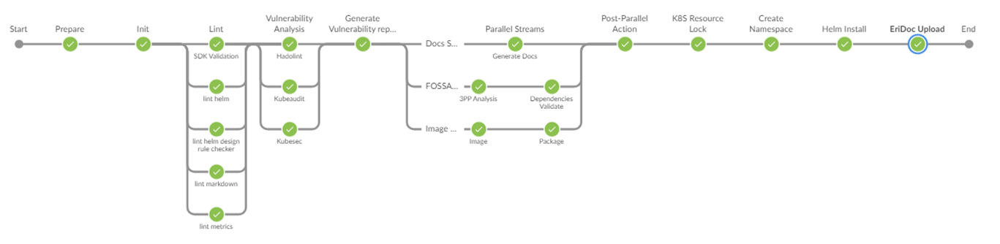
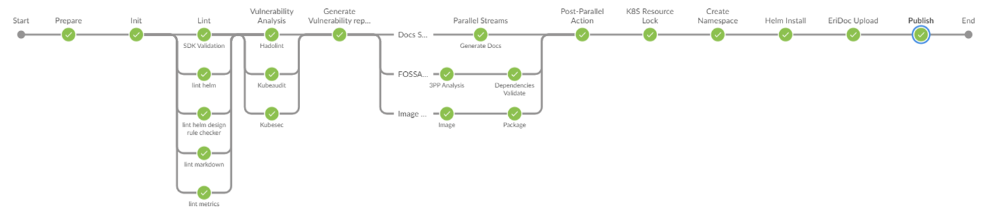

# [Other Language Golden Stages](https://eteamspace.internal.ericsson.com/display/DGBase/3.+Other+Language+Golden+Stages)

### Overview

The purpose of this page is to outline the Other Language Golden Stages in Precode Review and Publish pipelines for Development Teams to gain better understanding of each of the stages functionality. Other Language Microservice Projects refer to microservices written in C++, Python or other tech stacks

Note: Most of the stages and stage functionality in both PreCode Review and Publish Hybrid jobs are the same. There are some slight differences for example in regards to functionality in "Init", "Generate", "SonarQube" and "Declarative: Post Actions" stages, and a Unique "Publish" stage in the Publish job. Therefore in the outlined document section below called "Publish", only pipeline stages with differences are noted, with main description available in the PreCode Review Hybrid Pipeline Stages.

There are links provided to the files in Gerrit that make up the Hybrid MS CI Pipeline. For more information on these files, see:  [6. Key files of the Hybrid MS CI Pipeline solution](https://eteamspace.internal.ericsson.com/display/DGBase/6.+Key+files+of+the+Hybrid+MS+CI+Pipeline+solution)

### **PreCode Review -** **Golden** **Pipeline Stages**

 

### **[Prepare](https://gerrit.ericsson.se/plugins/gitiles/OSS/com.ericsson.oss.ci/oss-common-ci-utils/+/dVersion-2.0.0-hybrid/dsl/jenkinsFiles/other_precodereview.Jenkinsfile#25)**

-   Deletes directory first
-   It calls the script where it:
    -   Clones the existing development project
    -   CI controlled files are also cloned
    -   Environmental Variables are set from Development Team,  based on the local_pipeline_env.txt
    -   Build Name is set

-   Shows Bob help message and exits
-   Lists defined rules and does not print anything except output from the rules warnings and  to validate rules are correctly formed
-   Injects settings.xml into the job's workspace. to allow connecting to "JFrog Artifactory" and "eo-repositories" from Nexus

File Example:  [settings.xml](https://arm.seli.gic.ericsson.se/artifactory/proj-eric-oss-drop-generic-local/eric-oss/settings/settings_eric-oss-artifactory-repos.xml)

-   Cleans the job's workspace

  

See code for  **Prepare Stage**  here:

In the Jenkins file please search for Stage  _'Prepare'_

→  [ci_pipeline_init.groovy](https://gerrit.ericsson.se/plugins/gitiles/OSS/com.ericsson.oss.ci/oss-common-ci-utils/+/dVersion-2.0.0-hybrid/vars/ci_pipeline_init.groovy)

→  [PrecodeReview Jenkinsfile](https://gerrit.ericsson.se/plugins/gitiles/OSS/com.ericsson.oss.ci/oss-common-ci-utils/+/refs/heads/dVersion-2.0.0-hybrid/dsl/jenkinsFiles/other_precodereview.Jenkinsfile)

→  [Publish Jenkinsfile](https://gerrit.ericsson.se/plugins/gitiles/OSS/com.ericsson.oss.ci/oss-common-ci-utils/+/refs/heads/dVersion-2.0.0-hybrid/dsl/jenkinsFiles/other_publish.Jenkinsfile)

→  [ruleset2.0.yaml](https://gerrit.ericsson.se/plugins/gitiles/OSS/com.ericsson.oss.ci/oss-common-ci-utils/+/refs/heads/dVersion-2.0.0-hybrid/dsl/rulesetFiles/other_ruleset2.0.yaml)

### **[Init](https://gerrit.ericsson.se/plugins/gitiles/OSS/com.ericsson.oss.ci/oss-common-ci-utils/+/dVersion-2.0.0-hybrid/dsl/jenkinsFiles/other_precodereview.Jenkinsfile#43)**

-   Sets up Bob properties like version, rstate, gerrit commithash, author, revision, image version, image paths etc and outputs values into .bob/var.<property>
-   "image-ci-repopath" (proj-eric-oss-ci-internal) is the location for where the image will be pushed to
-   These .bob/var.* variables are available wherever bob commands are run.

  

See code for  **Init Stage**  here:

In the PCR Jenkins file please search for Stage  _'Init'_

In the ruleset please search for '_init-precodereview_'

→  [PrecodeReview Jenkinsfile](https://gerrit.ericsson.se/plugins/gitiles/OSS/com.ericsson.oss.ci/oss-common-ci-utils/+/refs/heads/dVersion-2.0.0-hybrid/dsl/jenkinsFiles/other_precodereview.Jenkinsfile)

→  [Publish Jenkinsfile](https://gerrit.ericsson.se/plugins/gitiles/OSS/com.ericsson.oss.ci/oss-common-ci-utils/+/refs/heads/dVersion-2.0.0-hybrid/dsl/jenkinsFiles/other_publish.Jenkinsfile)

→  [ruleset2.0.yaml](https://gerrit.ericsson.se/plugins/gitiles/OSS/com.ericsson.oss.ci/oss-common-ci-utils/+/refs/heads/dVersion-2.0.0-hybrid/dsl/rulesetFiles/other_ruleset2.0.yaml)

### **[Lint](https://gerrit.ericsson.se/plugins/gitiles/OSS/com.ericsson.oss.ci/oss-common-ci-utils/+/dVersion-2.0.0-hybrid/dsl/jenkinsFiles/other_precodereview.Jenkinsfile#55)**

Linting is the automated checking of your source code for programmatic, stylistic errors along with license compliance

-   The following files are archived in the "Build Artifacts" (available also in workspace) via the Jenkins file post always for the Lint stage:
    -   .bob/microservice-chassis-openapi.yaml_bth-linter-output.html
    -   .bob/design-rule-check-report.html
    -   .bob/design-rule-check-report.xml

**Lint Markdown**

-   Check markdown files and flag style issues
-   Regardless of the result command passes. (reason “|| true” at the end of command)

To support differing styles and/or preferences, markdownlint supports what are called 'style files'

A style file is a file describing which rules markdownlint should enable, and also what settings to apply to individual rules.

More info below:

-   [https://www.markdownguide.org/getting-started/](https://www.markdownguide.org/getting-started/)
-   [https://github.com/markdownlint/markdownlint](https://github.com/markdownlint/markdownlint)

**Lint Helm**

-   Runs a series of tests to verify that the Helm Chart is well-formed

More info: [https://helm.sh/docs/helm/helm_lint/](https://helm.sh/docs/helm/helm_lint/)

**Lint Helm Design Rule Check**

Is an Ericsson ADP specific checker

-   Verifies the whole Helm Chart (all files including Chart.yaml and values etc.) comply with the Design Rules set out by ADP

More info:  [https://eteamspace.internal.ericsson.com/display/AA/Helm+Chart+Design+Rules+and+Guidelines](https://eteamspace.internal.ericsson.com/display/AA/Helm+Chart+Design+Rules+and+Guidelines)

**Lint Code**

-   Verifies if files are missing the license header  
    
-   The files which contain the accepted license headers are specified using: <header></header> and <validHeader></validHeader> tags
    -   <header> → Location of the header.
    -   <validHeader> → Specifies additional header files

Files and folders which should not be checked are excluded using the: <exclude> </exclude> tags.

  

**Lint OpenAPI Spec**

-   APIs are linted using the BTH Linter against the rules defined in  [TEA - RESTful API Design Rules and Guidelines](https://eteamspace.internal.ericsson.com/display/TEA/RESTful+API+Design+Rules+and+Guidelines)
-   By default the linter expects OpenAPI spec file(s) to be located in the repository "src/main/resources/v1" directory. (Note: Hybrid microservices can define their custom OpenApi spec path in their common-properties.yaml)
-   By default the output is archived to: .bob/microservice-chassis-openapi.yaml_bth-linter-output.html
-   If there are any TEA rule failures, the build will fail

More info:  [API Linting](https://eteamspace.internal.ericsson.com/pages/viewpage.action?pageId=2024794600)

**Lint Metrics**

-   Uses a checker created by The Hummingbirds, which ensures that lines needed for metrics exposure are in fact implemented and not tampered with
-   Once the files are checked the console output will tell you which files need to be corrected and what necessary lines are missing

**SDK Validation**

There are three different verifications done in Validate SDK stage

-   Verify if the version of SDK templates used by microservice is correct
-   Verify if all the mandatory MD files are present / used by the microservice
-   Verify if menu.json provided is in proper Json format and all the files referenced in paths is available within SDK directory

See code for  **Lint Stage**  here:

In the PCR Jenkins file please search for Stage  _'Lint'_

In the ruleset please search for '_lint_'

→  [PrecodeReview Jenkinsfile](https://gerrit.ericsson.se/plugins/gitiles/OSS/com.ericsson.oss.ci/oss-common-ci-utils/+/refs/heads/dVersion-2.0.0-hybrid/dsl/jenkinsFiles/other_precodereview.Jenkinsfile)

→  [Publish Jenkinsfile](https://gerrit.ericsson.se/plugins/gitiles/OSS/com.ericsson.oss.ci/oss-common-ci-utils/+/refs/heads/dVersion-2.0.0-hybrid/dsl/jenkinsFiles/other_publish.Jenkinsfile)

→  [ruleset2.0.yaml](https://gerrit.ericsson.se/plugins/gitiles/OSS/com.ericsson.oss.ci/oss-common-ci-utils/+/refs/heads/dVersion-2.0.0-hybrid/dsl/rulesetFiles/other_ruleset2.0.yaml)

### **Docs Stream**

-   **[Generate Docs](https://gerrit.ericsson.se/plugins/gitiles/OSS/com.ericsson.oss.ci/oss-common-ci-utils/+/dVersion-2.0.0-hybrid/dsl/jenkinsFiles/other_precodereview.Jenkinsfile#95)**
    
-   **[Techdocs Upload](https://gerrit.ericsson.se/plugins/gitiles/OSS/com.ericsson.oss.ci/oss-common-ci-utils/+/89fbfb08e0bdbe76742ed9e3cf2b0491948c29e2/dsl/jenkinsFiles/other_precodereview.Jenkinsfile#179)**

  

**Generate Docs**

-   Generate documents: adoc, sdif, xml, html
-   Generated  documents and reports can be found in the build's workspace in the “build/doc” section

**Techdocs Upload:**

-   Performs a dry-run of the Techdocs Upload to the NM Internal Developer Portal.
-   For more info, please see:  [18. IDP Techdocs Upload](https://eteamspace.internal.ericsson.com/display/DGBase/18.+IDP+Techdocs+Upload)

  

  

See code for  **Docs Stream**  here:

In the PCR Jenkins file please search for Stage  _'Generate Docs' & 'Open API Spec'_

In the ruleset please search for '_generate-docs_' &  _'rest-2-html'_

→  [PrecodeReview Jenkinsfile](https://gerrit.ericsson.se/plugins/gitiles/OSS/com.ericsson.oss.ci/oss-common-ci-utils/+/refs/heads/dVersion-2.0.0-hybrid/dsl/jenkinsFiles/other_precodereview.Jenkinsfile)

→  [Publish Jenkinsfile](https://gerrit.ericsson.se/plugins/gitiles/OSS/com.ericsson.oss.ci/oss-common-ci-utils/+/refs/heads/dVersion-2.0.0-hybrid/dsl/jenkinsFiles/other_publish.Jenkinsfile)

→  [ruleset2.0.yaml](https://gerrit.ericsson.se/plugins/gitiles/OSS/com.ericsson.oss.ci/oss-common-ci-utils/+/refs/heads/dVersion-2.0.0-hybrid/dsl/rulesetFiles/other_ruleset2.0.yaml)

  

  

### **Image Stream**

-   **[Image](https://gerrit.ericsson.se/plugins/gitiles/OSS/com.ericsson.oss.ci/oss-common-ci-utils/+/dVersion-2.0.0-hybrid/dsl/jenkinsFiles/other_precodereview.Jenkinsfile#120)**
    
-   **[Package](https://gerrit.ericsson.se/plugins/gitiles/OSS/com.ericsson.oss.ci/oss-common-ci-utils/+/dVersion-2.0.0-hybrid/dsl/jenkinsFiles/other_precodereview.Jenkinsfile#140)**
    

**Image**

-   Builds a Docker image based on content of the Dockerfile provided
-   Checks if newly created image is compliance with image design rules, report available in .bob/check-image/
-   Archives image-design-rule-check-report*

**Package**

-   Push newly created Docker image to  [proj-eric-oss-ci-internal](https://arm.seli.gic.ericsson.se/artifactory/docker-v2-global-local/proj-eric-oss-ci-internal/), create internal version of helm chart and pushes it to internal repo [proj-eric-oss-ci-internal-helm-local](https://arm.seli.gic.ericsson.se/artifactory/proj-eric-oss-ci-internal-helm-local)  in the (SELI) Artifactory

See code for  **Image Stream**  here:

In the PCR Jenkins file please search for Stage  _'Image' & 'Package'_

In the ruleset please search for '_image_' & '_package'_

→  [PrecodeReview Jenkinsfile](https://gerrit.ericsson.se/plugins/gitiles/OSS/com.ericsson.oss.ci/oss-common-ci-utils/+/refs/heads/dVersion-2.0.0-hybrid/dsl/jenkinsFiles/other_precodereview.Jenkinsfile)

→  [Publish Jenkinsfile](https://gerrit.ericsson.se/plugins/gitiles/OSS/com.ericsson.oss.ci/oss-common-ci-utils/+/refs/heads/dVersion-2.0.0-hybrid/dsl/jenkinsFiles/other_publish.Jenkinsfile)

→  [ruleset2.0.yaml](https://gerrit.ericsson.se/plugins/gitiles/OSS/com.ericsson.oss.ci/oss-common-ci-utils/+/refs/heads/dVersion-2.0.0-hybrid/dsl/rulesetFiles/other_ruleset2.0.yaml)

### **FOSSA Stream**

-   **[FOSSA Analyze](https://gerrit.ericsson.se/plugins/gitiles/OSS/com.ericsson.oss.ci/oss-common-ci-utils/+/dVersion-2.0.0-hybrid/dsl/jenkinsFiles/other_precodereview.Jenkinsfile#164)**
    
-   **[FOSSA Fetch Report](https://gerrit.ericsson.se/plugins/gitiles/OSS/com.ericsson.oss.ci/oss-common-ci-utils/+/dVersion-2.0.0-hybrid/dsl/jenkinsFiles/other_precodereview.Jenkinsfile#164)**
    
-   **[FOSSA Dependency Validate](https://gerrit.ericsson.se/plugins/gitiles/OSS/com.ericsson.oss.ci/oss-common-ci-utils/+/dVersion-2.0.0-hybrid/dsl/jenkinsFiles/other_precodereview.Jenkinsfile#176)**
    

**FOSSA Analyze**

-   FOSSA Analyze command runs the FOSSA scan and uploads the FOSSA results to the [server](https://scasfossa.internal.ericsson.com/projects)
-   It checks all the dependencies and sends to the FOSSA server
-   Once the FOSSA scan is completed you will be able to see your project summary, issues dependencies, licenses and a series of different Vulnerability and Compliance reports on the [server](https://scasfossa.internal.ericsson.com/projects)
-   For more information please see:  [11. FOSSA Scanning](https://eteamspace.internal.ericsson.com/display/DGBase/11.+FOSSA+Scanning)

**FOSSA Fetch Report**

-   In this stage we run two rules. First one is fossa-scan-status-check. To be able to automate fully the analysis and the report fetching, the tool should be able to tell user when the analysis is done, so user can fetch the report and continue with Scas scan and registration. FOSSA status check script uses the “hidden” FOSSA REST API to check status and shows status of request every 15 seconds until the request ends with SUCCEEDED
-   The next rule we run is fetch-fossa-report-attribution which retrieves information about the latest FOSSA scan. It outputs a json report for the project that includes information about the dependencies used and their licenses
-   For more information please see:  [11. FOSSA Scanning](https://eteamspace.internal.ericsson.com/display/DGBase/11.+FOSSA+Scanning)

**FOSSA Dependency Validate**

This will validate an existing dependencies.yaml document . The validate sub-command will check the below:

-   Check the dependencies.yaml align with the  dependencies json schema
-   Check  **no mandatory  attributes missing**  in dependencies.yaml file
-   Check all dependencies are registered in Scas and approved
-   Check that all **stako**  are ESW1 or ESW2
    -   For ESW3 (Primary and secondary dependencies), and ESW4 (Only for secondary dependencies), which should not be used, validate sub-command will check that  **stako_decision_reason** field is updated manually (Should not be equal to default value='automatic') and team take responsibility)  
        
-   Check and print warning message for any license found from list of **weakly** and **strongly** protective licenses
-   Check that all '**recode**' attributes values are "REL", "RE0" or "RE1". Other values are restricted. If 'recode' value is not set (recode = '' ) script will allow it and will not fail

For more information please see:  [11. FOSSA Scanning](https://eteamspace.internal.ericsson.com/display/DGBase/11.+FOSSA+Scanning) & [Microservice CI Pipeline FOSS Gate Process](https://eteamspace.internal.ericsson.com/pages/viewpage.action?pageId=2019828851)

See code for  **FOSSA Stream**  here:

In the PCR Jenkins file please search for Stage  _'FOSSA Stream'_

In the ruleset please search rules starting with  _'fossa'_

→  [PrecodeReview Jenkinsfile](https://gerrit.ericsson.se/plugins/gitiles/OSS/com.ericsson.oss.ci/oss-common-ci-utils/+/refs/heads/dVersion-2.0.0-hybrid/dsl/jenkinsFiles/other_precodereview.Jenkinsfile)

→  [Publish Jenkinsfile](https://gerrit.ericsson.se/plugins/gitiles/OSS/com.ericsson.oss.ci/oss-common-ci-utils/+/refs/heads/dVersion-2.0.0-hybrid/dsl/jenkinsFiles/other_publish.Jenkinsfile)

→  [ruleset2.0.yaml](https://gerrit.ericsson.se/plugins/gitiles/OSS/com.ericsson.oss.ci/oss-common-ci-utils/+/refs/heads/dVersion-2.0.0-hybrid/dsl/rulesetFiles/other_ruleset2.0.yaml)

### **[Post Parallel Action](https://gerrit.ericsson.se/plugins/gitiles/OSS/com.ericsson.oss.ci/oss-common-ci-utils/+/dVersion-2.0.0-hybrid/dsl/jenkinsFiles/other_precodereview.Jenkinsfile#194)**

Custom stage that runs after the parallel streams

### **[K8S Resource Lock](https://gerrit.ericsson.se/plugins/gitiles/OSS/com.ericsson.oss.ci/oss-common-ci-utils/+/dVersion-2.0.0-hybrid/dsl/jenkinsFiles/other_precodereview.Jenkinsfile#200)**

Retrieves a lock on a KaaS cluster (e.g. hahn186) namespace resource for the following stages

-   Helm Install
-   K8S Test
-   Vulnerability Analysis

For more info: [How to manage Kubernetes resource pool using Jenkins Lockable Resources](https://eteamspace.internal.ericsson.com/display/DGBase/How+to+manage+Kubernetes+resource+pool+using+Jenkins+Lockable+Resources)

  

**[Create Namespace](https://gerrit.ericsson.se/plugins/gitiles/OSS/com.ericsson.oss.ci/oss-common-ci-utils/+/dVersion-2.0.0-hybrid/dsl/jenkinsFiles/other_precodereview.Jenkinsfile#209)**

-   Injects Kubernetes config file
-   Renders chart templates locally and display the output
-   Check the KAAS cluster to see if namespace exists matching reserved k8s resource namespace
-   If a namespace exists on the cluster delete the namespace
-   Create the namespace for the microservice in kubectl
-   Namespace name is retrieved from Lockable Resource Kubernetes namespace pooling

**[Helm Install](https://gerrit.ericsson.se/plugins/gitiles/OSS/com.ericsson.oss.ci/oss-common-ci-utils/+/dVersion-2.0.0-hybrid/dsl/jenkinsFiles/other_precodereview.Jenkinsfile#219)**

-   **Helm dry run**,
    -   Tests the template rendering, but not actually install anything. It gives assurance if a "helm install" would be successful
    -   Executed on local Helm stored in .bob directory and produces helm-install-dry-run.logIt then deletes all the generated files.

If HELM_INSTALL_ENABLED environment variable is set to false this stage is skipped otherwise if variable is set to true then flow is as per bellow:

-   **Helm install**  the packaged chart (helm-install-or-upgrade)
    -   Relies on a Docker image which has been previously uploaded to a remote repository (step Package Helm)

If stage is successful or not, the kaas-info is stored post the Stage

If the stage is unsuccessful:

-   k8s logs are collected and some logs achieved (helm-install-dry-run.log is only achieved in the Publish job) → ${bob} collect-k8s-logs
-   namespace deleted → ${bob} delete-namespace

**[Vulnerability Analysis](https://gerrit.ericsson.se/plugins/gitiles/OSS/com.ericsson.oss.ci/oss-common-ci-utils/+/dVersion-2.0.0-hybrid/dsl/jenkinsFiles/other_precodereview.Jenkinsfile#247)**

**Vulnerability** tools in the pipeline include: Hadolint, Kubehunter, Kubeaudit, Kubesec, Trivy, X-Ray, Anchore-Grype, NMAP Unicorn

For functionality and more information on Vulnerability Analysis please read below User Guide:

[Vulnerability Analysis Tools User Guide](https://confluence-oss.seli.wh.rnd.internal.ericsson.com/display/DGBase/Vulnerability+Analysis+Tools+User+Guide)

If **env.VA_ENABLED** is set to false  all the Vulnerability Analysis are skipped, there is no need to skip them individually again.

However if developer wishes to skip any of VA stages individually then individual env. variables need to be set to false as per example below:

env.HADOLINT_ENABLED == "false"

See code for  **K8s Resource Lock**  here:

In the PCR Jenkins file please search for Stage  _'Create Namespace', 'Helm Install'_ & _'Vulnerability Analysis'_

→  [PrecodeReview Jenkinsfile](https://gerrit.ericsson.se/plugins/gitiles/OSS/com.ericsson.oss.ci/oss-common-ci-utils/+/refs/heads/dVersion-2.0.0-hybrid/dsl/jenkinsFiles/other_precodereview.Jenkinsfile)

→  [Publish Jenkinsfile](https://gerrit.ericsson.se/plugins/gitiles/OSS/com.ericsson.oss.ci/oss-common-ci-utils/+/refs/heads/dVersion-2.0.0-hybrid/dsl/jenkinsFiles/other_publish.Jenkinsfile)

→  [ruleset2.0.yaml](https://gerrit.ericsson.se/plugins/gitiles/OSS/com.ericsson.oss.ci/oss-common-ci-utils/+/refs/heads/dVersion-2.0.0-hybrid/dsl/rulesetFiles/other_ruleset2.0.yaml)

### **[Generate Vulnerability Report 2.0](https://gerrit.ericsson.se/plugins/gitiles/OSS/com.ericsson.oss.ci/oss-common-ci-utils/+/dVersion-2.0.0-hybrid/dsl/jenkinsFiles/other_precodereview.Jenkinsfile#378)**

For more information on Generating Vulnerability Report please read:

[Vulnerability Analysis Tools User Guide](https://confluence-oss.seli.wh.rnd.internal.ericsson.com/display/DGBase/Vulnerability+Analysis+Tools+User+Guide)

Functionality for Readable VA Report. More info here:  [VA Readable Report Rollout](https://eteamspace.internal.ericsson.com/display/DGBase/VA+Readable+Report+Rollout)

See code for  **Generate Vulnerability report V2.0** here:

In the PCR Jenkins file please search for Stage  _'Generate Vulnerability report V2.0'_

→  [PrecodeReview Jenkinsfile](https://gerrit.ericsson.se/plugins/gitiles/OSS/com.ericsson.oss.ci/oss-common-ci-utils/+/refs/heads/dVersion-2.0.0-hybrid/dsl/jenkinsFiles/other_precodereview.Jenkinsfile)

→  [Publish Jenkinsfile](https://gerrit.ericsson.se/plugins/gitiles/OSS/com.ericsson.oss.ci/oss-common-ci-utils/+/refs/heads/dVersion-2.0.0-hybrid/dsl/jenkinsFiles/other_publish.Jenkinsfile)

→  [ruleset2.0.yaml](https://gerrit.ericsson.se/plugins/gitiles/OSS/com.ericsson.oss.ci/oss-common-ci-utils/+/refs/heads/dVersion-2.0.0-hybrid/dsl/rulesetFiles/other_ruleset2.0.yaml)

### **[EriDoc Upload](https://gerrit.ericsson.se/plugins/gitiles/OSS/com.ericsson.oss.ci/oss-common-ci-utils/+/dVersion-2.0.0-hybrid/dsl/jenkinsFiles/other_precodereview.Jenkinsfile#403)**

-   Converts the required documents from .md format to .pdf format.
-   Perform the dry-run of the EriDoc upload.

  

See code for  **EriDoc Upload**  stage here:

In the PCR Jenkins file please search for Stage  _'EriDoc Upload'_

In the ruleset please search for 'eridoc-upload'

→  [PrecodeReview Jenkinsfile](https://gerrit.ericsson.se/plugins/gitiles/OSS/com.ericsson.oss.ci/oss-common-ci-utils/+/refs/heads/dVersion-2.0.0-hybrid/dsl/jenkinsFiles/other_precodereview.Jenkinsfile)

→  [Publish Jenkinsfile](https://gerrit.ericsson.se/plugins/gitiles/OSS/com.ericsson.oss.ci/oss-common-ci-utils/+/refs/heads/dVersion-2.0.0-hybrid/dsl/jenkinsFiles/other_publish.Jenkinsfile)

→  [ruleset2.0.yaml](https://gerrit.ericsson.se/plugins/gitiles/OSS/com.ericsson.oss.ci/oss-common-ci-utils/+/refs/heads/dVersion-2.0.0-hybrid/dsl/rulesetFiles/other_ruleset2.0.yaml)

### **[Declarative: Post Actions](https://gerrit.ericsson.se/plugins/gitiles/OSS/com.ericsson.oss.ci/oss-common-ci-utils/+/dVersion-2.0.0-hybrid/dsl/jenkinsFiles/other_precodereview.Jenkinsfile#422)**

-   Happens at the end of the Jenkins pipeline
-   Deletes Docker Images from the Grid Engines
-   Archives Jenkins file and ruleset file to the "Build Artifacts"

 

## **Publish - Golden Pipeline Stages**

### **[Init](https://gerrit.ericsson.se/plugins/gitiles/OSS/com.ericsson.oss.ci/oss-common-ci-utils/+/dVersion-2.0.0-hybrid/dsl/jenkinsFiles/other_publish.Jenkinsfile#44)**

-   In addition to the Init step performed during the PreCodeReview, (setting bob properties) ADP properties are also set and stored into artifact.properties
    

"image-ci-repopath-drop" (proj-eric-oss-drop) is the location for where the image will be pushed to

  

See code for  **Init**  here:

In the Publish Jenkins file please search for Stage  _'Init'_

In the ruleset please search for the rule  _'init-drop'_

→  [PrecodeReview Jenkinsfile](https://gerrit.ericsson.se/plugins/gitiles/OSS/com.ericsson.oss.ci/oss-common-ci-utils/+/refs/heads/dVersion-2.0.0-hybrid/dsl/jenkinsFiles/other_precodereview.Jenkinsfile)

→  [Publish Jenkinsfile](https://gerrit.ericsson.se/plugins/gitiles/OSS/com.ericsson.oss.ci/oss-common-ci-utils/+/refs/heads/dVersion-2.0.0-hybrid/dsl/jenkinsFiles/other_publish.Jenkinsfile)

→  [ruleset2.0.yaml](https://gerrit.ericsson.se/plugins/gitiles/OSS/com.ericsson.oss.ci/oss-common-ci-utils/+/refs/heads/dVersion-2.0.0-hybrid/dsl/rulesetFiles/other_ruleset2.0.yaml)

### **Docs Stream**

**[Techdocs Upload](https://gerrit.ericsson.se/plugins/gitiles/OSS/com.ericsson.oss.ci/oss-common-ci-utils/+/89fbfb08e0bdbe76742ed9e3cf2b0491948c29e2/dsl/jenkinsFiles/other_publish.Jenkinsfile#184)**

**Techdocs Upload:**

-   Uploads Techdocs to the NM Internal Developer Portal.
-   For more info, please see:  [18. IDP Techdocs Upload](https://eteamspace.internal.ericsson.com/display/DGBase/18.+IDP+Techdocs+Upload)

### **[EriDoc Upload](https://gerrit.ericsson.se/plugins/gitiles/OSS/com.ericsson.oss.ci/oss-common-ci-utils/+/dVersion-2.0.0-hybrid/dsl/jenkinsFiles/other_publish.Jenkinsfile#414)**

-   As mentioned in PreCodeReview, it converts the required documents from .md to .pdf format.
-   Upload the .pdf documents to the EriDoc portal.
-   Approves the uploaded documents in the EriDoc portal.  
      
    

See code for  **EriDoc Upload**  stage here:

In the Publish Jenkins file please search for Stage  _'EriDoc Upload'_

In the ruleset please search for 'eridoc-upload'

→  [PrecodeReview Jenkinsfile](https://gerrit.ericsson.se/plugins/gitiles/OSS/com.ericsson.oss.ci/oss-common-ci-utils/+/refs/heads/dVersion-2.0.0-hybrid/dsl/jenkinsFiles/other_precodereview.Jenkinsfile)

→  [Publish Jenkinsfile](https://gerrit.ericsson.se/plugins/gitiles/OSS/com.ericsson.oss.ci/oss-common-ci-utils/+/refs/heads/dVersion-2.0.0-hybrid/dsl/jenkinsFiles/other_publish.Jenkinsfile)

→  [ruleset2.0.yaml](https://gerrit.ericsson.se/plugins/gitiles/OSS/com.ericsson.oss.ci/oss-common-ci-utils/+/refs/heads/dVersion-2.0.0-hybrid/dsl/rulesetFiles/other_ruleset2.0.yaml)

### **[Publish](https://gerrit.ericsson.se/plugins/gitiles/OSS/com.ericsson.oss.ci/oss-common-ci-utils/+/dVersion-2.0.0-hybrid/dsl/jenkinsFiles/other_publish.Jenkinsfile#433)**

-   **Publish** Docker Images and Helm Charts to drop repository
-   The parameters of (already built) Helm chart is updated, internal image is **pulled** from proj-eric-oss**-ci-internal**  , tagged with version, and **pushed** to proj-eric-oss**-drop**
    
-   **Upload Helm Chart** to help drop repo proj-eric-oss-drop-helm-local
    
-   **Publish-md-oas**  zips and publishes OAS files to the Jfrog central Artifactory
    

  

See code for  **Publish** here:

In the Publish Jenkins file please search for Stage  _'Publish'_

In the ruleset please search rules starting with  _'publish'_

→  [PrecodeReview Jenkinsfile](https://gerrit.ericsson.se/plugins/gitiles/OSS/com.ericsson.oss.ci/oss-common-ci-utils/+/refs/heads/dVersion-2.0.0-hybrid/dsl/jenkinsFiles/other_precodereview.Jenkinsfile)

→  [Publish Jenkinsfile](https://gerrit.ericsson.se/plugins/gitiles/OSS/com.ericsson.oss.ci/oss-common-ci-utils/+/refs/heads/dVersion-2.0.0-hybrid/dsl/jenkinsFiles/other_publish.Jenkinsfile)

→  [ruleset2.0.yaml](https://gerrit.ericsson.se/plugins/gitiles/OSS/com.ericsson.oss.ci/oss-common-ci-utils/+/refs/heads/dVersion-2.0.0-hybrid/dsl/rulesetFiles/other_ruleset2.0.yaml)

### **[Declarative: Post Actions](https://gerrit.ericsson.se/plugins/gitiles/OSS/com.ericsson.oss.ci/oss-common-ci-utils/+/dVersion-2.0.0-hybrid/dsl/jenkinsFiles/other_publish.Jenkinsfile#458)**

-   Docker command increments the VERSION_PREFIX file version and change is pushed to Gerrit
-   Happens at the end of the Jenkins pipeline
-   Checks if Helm Chart report contains any warnings.  If found an email is sent to the team (email address specified in build variable EMAIL)

 

***To upload documents to Marketplace:  
Teams will have to add it as a custom stage [How to Add a Custom Stage](https://eteamspace.internal.ericsson.com/display/DGBase/1.+How+to+add+a+Custom+Stage)  
More info on how to do it [Upload Documentation to Marketplace](https://eteamspace.internal.ericsson.com/display/DGBase/6.+Upload+documentation+to+Marketplace)***