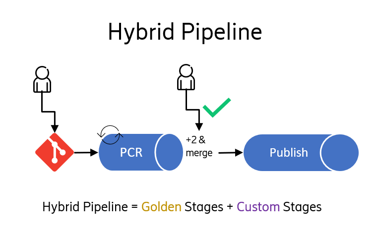

# Overview

## What is the NM Hybrid MS CI Pipeline?

The NM Hybrid MS CI Pipeline is an automated Jenkins pipeline solution made up of a Precode Review (PCR) pipeline and a Publish (PUB) pipeline, which are then made up of Golden Stages and Custom Stages. The use of the term "Hybrid" comes from the utilization of both Golden and Custom Stages in the MS CI pipeline.
  

  

## What is a Golden Stage?

A Golden Stage is a stage in the PCR and PUB pipeline that is expected to run in the Microservice CI pipeline to ensure high code quality and high maturity standards.

For examples of Golden stages that are run in the Hybrid MS CI pipeline today see this confluence page and its respective child pages: [2. Golden Stages](https://eteamspace.internal.ericsson.com/display/DGBase/2.+Golden+Stages)
  

## What is a Custom Stage?

A Custom Stage is a stage in the PCR and PUB pipeline that is specific to an individual project. This allows design teams to have the freedom of innovation in their Hybrid MS CI pipeline.

For examples of Custom Stages that are run in the Hybrid MS CI pipeline today and for steps on how to create your own Custom Stage see this confluence page and its respective child pages: [3. Custom Stages](https://eteamspace.internal.ericsson.com/display/DGBase/3.+Custom+Stages)
  

## What is the Hybrid MS CI Pipeline made up of?

The Hybrid MS CI Pipeline is made up of a set of Hummingbirds Centrally managed MS CI files, along with Local repository CI files.

For examples of these files see this confluence page here: [6. Key files of the Hybrid MS CI Pipeline solution](https://eteamspace.internal.ericsson.com/display/DGBase/6.+Key+files+of+the+Hybrid+MS+CI+Pipeline+solution)
  

## Where is the NM Hybrid MS CI Pipeline solution today?

The Hybrid MS CI Pipeline Solution is currently on Jenkins FEMs maintained by Hummingbirds.

See these here:

- [https://fem1s11-eiffel216.eiffel.gic.ericsson.se:8443/jenkins/](https://fem1s11-eiffel216.eiffel.gic.ericsson.se:8443/jenkins/)
- [https://fem6s11-eiffel216.eiffel.gic.ericsson.se:8443/jenkins/](https://fem6s11-eiffel216.eiffel.gic.ericsson.se:8443/jenkins/)
    

## What are the benefits to the NM Hybrid pipeline?

- Ensure consistent, standardized processes to build, test, and deploy Microservice code.
- Golden stages refers to the CICD Architect approved stages and associated rules to ensure Hybrid Pipeline Microservices are compliant with code quality and maturity standards set out by projects. With the Hybrid MS CI Pipeline, design teams get these Golden Stages out of the box for free rolled out into their automated MS CI.
- Less maintenance, less upkeep of MS CI for development teams.
- More stable MS CI pipelines.
- Quicker onboarding when new stage is introduced.
- Gives confidence that each Microservice is at a position to meet a project's maturity and quality expectations without preventing and encouraging teams from innovating and contribution to improve the way of working as a whole.
- Some of the Quality Bar Stages:
  - SonarQube – static code analysis to detects bugs, code smells and enforced code reliability, security, calculate code line coverage and maintainability metrics
  - Linting – to validate Helm chart and Docker images compliant to ADP Design Rules
  - VA scans – to check for vulnerabilities in helm chart and docker images
  - FOSSA scans – to validate the 3PP dependencies used in the project  
