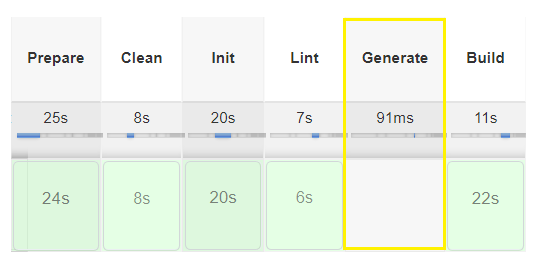
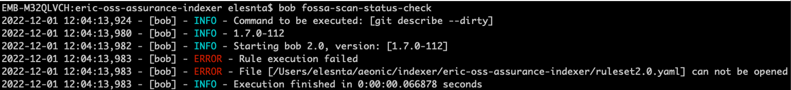
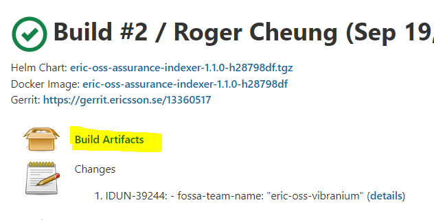

# Working with Hybrid MS CI Pipeline - Hands-on
<br>
## Overview

This page guides users of the Hybrid MS CI Pipeline in different scenarios. Provides answers to some questions users have been asking.

This assumes you have read [Hybrid MS CI Pipeline - overview](https://eteamspace.internal.ericsson.com/display/DGBase/1.+NM+Hybrid+MS+CI+pipeline)  and  [6. Key files of the Hybrid MS CI Pipeline solution](https://eteamspace.internal.ericsson.com/display/DGBase/6.+Key+files+of+the+Hybrid+MS+CI+Pipeline+solution)

  

### Expected project structure + file names
```bash
│
├───bob
├───charts
├───ci
│ ├───scripts
| | └──metrics-checker.sh
| ├──local_pipeline_env.txt
| |
├───config
| ├──hadolint_config.yaml
| ├──kubeaudit_config.yaml
| ├──kubesec_config.yaml
| ├──marketplace_config.config
| ├──marketplace_upload_config.config
| ├──va-report.config
| |
| |
├───fossa
| ├───doc
| ├───dependencies.yaml
|
├───license
| ├───copyright-2022.txt
|
├───.gitignore
├───.gitmodules
├───common-properties.yaml
├───Dockerfile
├───healthcheck.sh
├───pom.xml
├───VERSION_PREFIX

```
* ci/scripts/metrics-checker.sh → used in [lint] task:[metrics-check]

* config/hadolint_config.yaml, config/kubeaudit_config.yaml, config/kubesec_config.yaml → used in respective VA stage

* config/marketplace_upload_config.config → used in [publish-md-oas] task:[upload-md-oas]

* config/marketplace_config.config → used in used in [publish-md-oas] task:[zipping-md-oas]

* config/va-report.config → used in [generate-VA-report-V2 stage]

* fossa/dependencies.yaml → used in various fossa stages

<br>

### Expected common-properties.yaml file content

[original source - ms Chassis](https://gerrit.ericsson.se/gitweb?p=OSS/com.ericsson.oss.de/microservice-chassis.git;a=blob_plain;f=src/main/resources/archetype-resources/common-properties.yaml;hb=refs/heads/master)

```

## Don't forget license header
properties:
# Microservice artifactID
- project-artifact-id: <artifact_Id>
# Microservice helm chart name
- helm-chart-name: <helm_Chart_Name>
# Microservice docker image name
- docker-image-name: <helm_Chart_Name>
# Path to YAML file containing all needed information about product structure to release in PRIM
- dpraf-config-file: 'ci_config/dpraf_config.yaml'
# Local folder where the dpraf output is generated based on dpraf-config-file during execution of adp-prim-release rule
- dpraf-output-dir: 'build/dpraf-output'
# Configuration file for EriDoc documents
- eridoc-config: "ci_config/eridoc_config.yaml"
# Static information for PRI
- pri-manual-input: "ci_config/pri_manual_input.json"
# Product extended name in JIRA
- jira-component-name: "Bob"
# Gerrit repository name
- gerrit-repo-name: <full_rerrit_Repo_Path>
# Gerrit repository URL
- gerrit-url: "[https://gerrit.ericsson.se/plugins/gitiles/<full_rerrit_Repo_Path](https://gerrit.ericsson.se/plugins/gitiles/%3Cfull_rerrit_Repo_Path)>/"
# Image product number
- image-product-number: "<productNum>"
# FOSSA team name
- fossa-team-name: "<fossa_Team_Name>"
# cbos image repo path
- cbos-image-repo: armdocker.rnd.ericsson.se/proj-ldc/common_base_os_release
# cbos name
- cbos-image-name: sles
# cbos version
- cbos-image-version: 5.8.0-21

```
<br>

### Running default golden stages

After either project is set up as hybrid or is fully migrated running Hybrid  pipelines,  golden stages  _does not_ require any action from dev team.

If design team is happy with default stages and does not need any additional configuration, nothing is required from design team, giving the dev team more time to concentrate on their code..

NOTE: Default value for "validateSdk=false" if you require execute this check please modify ci/local_pipeline_env.txt

### How to switch golden stages on / off

Each stage in the Golden Jenkinsfile first validates a when{} condition.

Variables and corresponding Boolean values are defined in the  _ci/local_pipeline_env.txt._  (see sample default values)

By updating the values in the file, design team can control which stages get executed. (Update value and submit code review)

NOTE: the same values are affecting PCR (preCodeReview) and Publish jobs.

For instance, setting  _GENERATE_ENABLED=false_ will skip the generate stage both in pcr and Publish  _._ The skipped pipeline stages will be greyed out in the pipeline and in the [MRV dashboard](https://mrv.ews.gic.ericsson.se/#/products/EIAP)

<br>



_For more information on the environment variables and the golden stages they control, please refer to the_ [Jenkinsfiles](https://gerrit.ericsson.se/plugins/gitiles/OSS/com.ericsson.oss.ci/oss-common-ci-utils/+/dVersion-2.0.0-hybrid/dsl/jenkinsFiles/)  directory in the ci-utils repo


***Demo***


***Demo for enabling/disabling Golden Stage can be found here:  [Enable Disable Stage.mp4](https://ericsson.sharepoint.com/:v:/s/TheHummingbirds/ERvXL4G-FpFJnydqneg8uT4Bo3UJ8tgADPQ7-b2FZhH3MQ?e=pPk1Ko&nav=eyJyZWZlcnJhbEluZm8iOnsicmVmZXJyYWxBcHAiOiJTdHJlYW1XZWJBcHAiLCJyZWZlcnJhbFZpZXciOiJTaGFyZURpYWxvZy1MaW5rIiwicmVmZXJyYWxBcHBQbGF0Zm9ybSI6IldlYiIsInJlZmVycmFsTW9kZSI6InZpZXcifX0%3D)***


### How to add a custom stage

In the situation where the design team needs to execute additional functionality or they would like to see result of altered golden rule, a custom stage with custom ruleset must be created

For that couple of files need to to created or modify if already exist

1.  Create Custom Jenkinsfile with name pattern  **<name-of-custom-jenkinsfile>.Jenkinsfile**" in the "**ci**" directory.
    *  Add  **stage{}** section to the file.
    *  Jenkinsfile can contain one or more stages.
    *  IMPORTANT_:_ custom Jenkinsfiles must be written in scripted pipeline syntax
    *  Suggestion - declare the ruleset to load either or both custom ruleset file and common ruleset and then use it in the bob command
    * Example at the top of custom Jenkinsfile

```bash
    
#!/usr/bin/env groovy
def bob = "./bob/bob"
def ruleset = "ci/local_ruleset.yaml"  #Reference to the custom, project specific ruleset
def ci_ruleset = "ci/common_ruleset2.0.yaml" #Reference to the common ruleset
stage('Loaded Lint') {
sh "${bob} -r ${ci_ruleset} validate-sdk"
sh "${bob} -r ${ruleset} lint:helm-chart-check"
}

```
    * Couple of samples here: _[ci/lint-generate.Jenkinsfile](https://gerrit.ericsson.se/#/c/14376037/1/ci/lint-generate.Jenkinsfile)_
2. Create "**local_ruleset.yaml**" and store it in the "**ci**" directory. Normal ruleset syntax applies including the import of common-properties.yaml
	* Sample ruleset: [ci/local_ruleset.yaml](https://gerrit.ericsson.se/gitweb?p=OSS/com.ericsson.oss.air/eric-oss-pm-stats-exporter.git;a=blob_plain;f=ci/local_ruleset.yaml;hb=refs/heads/master)_
        

**The local ruleset should have only the tasks/rules relevant to the custom jenkinsfile (custom stages) , please refer to common_ruleset file for reference :  [common_ruleset2.0.yaml](https://gerrit.ericsson.se/gitweb?p=OSS/com.ericsson.oss.ci/oss-common-ci-utils.git;a=blob_plain;f=dsl/rulesetFiles/common_ruleset2.0.yaml;hb=refs/heads/dVersion-2.0.0-hybrid). This file contains all the tasks used for golden stages.**
```bash

import:
common:  ../common-properties.yaml

```

3.  Create (or modify)  **custom_stages.yaml  _in the_ _"ci"_  _directory_**
    *  Add name of the marker (which denotes location where to load custom file) and name of the Jenkinsfile you just created. Sample  _[ci/custom_stages.yaml](https://gerrit.ericsson.se/#/c/14376037/1/ci/custom_stages.yaml)_
    *  For the exact placement of the markers, please refer to the jenkinsfiles outlined in [Centrally managed CI Files](https://eteamspace.internal.ericsson.com/display/DGBase/6.+Key+files+of+the+Hybrid+MS+CI+Pipeline+solution). (please look for "**ci_load_custom_stages**" in the Jenkinsfiles)
Demo

***Demo for adding Custom Stage can be found here: [Custom Stages in Hybrid Pipeline.mp4](https://ericsson.sharepoint.com/:v:/s/TheHummingbirds/Ed6cb8CY40VJgyNwNq9uGw8B31khug60sXBspVeCJQkrqA?e=VBGs8h&nav=eyJyZWZlcnJhbEluZm8iOnsicmVmZXJyYWxBcHAiOiJTdHJlYW1XZWJBcHAiLCJyZWZlcnJhbFZpZXciOiJTaGFyZURpYWxvZy1MaW5rIiwicmVmZXJyYWxBcHBQbGF0Zm9ybSI6IldlYiIsInJlZmVycmFsTW9kZSI6InZpZXcifX0%3D)***

### How to add a custom stage with different functionality in PCR and Publish jobs

The same marker name is used in both PreCodeReview and Publish jobs, meaning by default the same functionality will be applied in both jobs  
However, if you need to have different functionality in the PCR and Publish job for the same custom stage

You need to construct if statement based on the condition of 'env.RELEASE'  
  

In the common_publish.Jenkinsfile you will notice there is environment variable RELEASE defined to be used during versioning update. the same variable to be used to specify different functionality
**env.RELEASE in common_publish.Jenkinsfile**
```bash
environment {
RELEASE = "true"
}
```
Sample: Same custom stage - different functionality in PCR and Publish jobs
**custom stage using env.RELEASE**
```bash
stage('Stage in both PCR and Publish') {
script {
if (env.RELEASE) {
<add Publish job specific functionality>
	   }
else {
<add PCR job specific functionality>
		}
	}
}
```
Sample: Publish Job specific stage
**custom stage using env.RELEASE**
```bash
if (env.RELEASE) {
stage('Stage only in the publish job') {
<add publish job specific functionality>
	}
}
```
[sample file](https://gerrit.ericsson.se/gitweb?p=OSS/com.ericsson.oss.service.common.usermgmt/usermgmt-service.git;a=blob;f=ci/markerfossa.Jenkinsfile;hb=256ac6b4cce4363fad9d6a2084c3aec3a9580fae)

### How to run golden stage silently - giving feedback but not failing build if failure detected

Design team need to skip the golden stage, and create a custom stage. Follow instructions above

This way design team decides either to update jenkinsfile (sh 'exit 0' or add catchError(stageResult: 'FAILURE') {} ) or rule in the ruleset (pipe cmd to true) to allow build to continue if failure is detected

### How to run Hybrid pipeline golden rule bob commands locally  

As Jenkinsfile and  Rulesetfile  is not stored with the repo - you will get error "ruleset2.0.yaml can not be opened"



<br>

To eliminate the issue you **need to copy the ruleset file** (full or just rules that you need) **either from a hybrid job's workspace, build's artifacts or from CI Utils repo** (see link in the CI managed files)




<br>

***NOTE: After adding file to the repo locally you need to either update file name to "ruleset2.0.yaml" or any other meaningful name and provide path to ruleset file with  **-r**  option***

./bob/bob -r copy_of_common_ruleset2.0.yaml clean 

After adding a copy of the ruleset file take actions according with your team's needs

Note that by default .gitignore excludes only ci/common_ruleset2.0.yaml from adding to the repo commit, so take this into the consideration

-   Our guidance is not to submit local copy to the Gerrit repo, to avoid a confusion especially avoid default name and default location of the ruleset file  e.g **ci/common_ruleset2.0.yaml**)

<br>

***Do not save CI managed file with the default name and in the default location e.g ci/common_ruleset2.0.yaml.***
***Do not modify ci/common_ruleset2.0.yaml. Do not push to gerrit (do not remove entry in gitignore).***
***File will be replaced with centrally stored file in the pipeline jobs. To ensure that all microservices implement the rules and tasks defined by the program.***

***But it might cause confusion among developers if file with CI default name/location is saved.*** 

***If you need custom rules see section [How to add a custom stage](https://eteamspace.internal.ericsson.com/display/DGBase/1.+How+to+add+a+Custom+Stage)***

Also note the local copy of the ruleset file - will be just that a copy for executing rules locally, it will not be used when exacting golden rules in the hybrid pipelines. And any delta between the rules in the local copy and centrally managed ruleset file is up to each team to align.

  <br>

### _Other links_

-   _Sample Jenkins jobs:  [usermgmt-service](https://fem1s11-eiffel216.eiffel.gic.ericsson.se:8443/jenkins/job/usermgmt-service_PreCodeReview_Hybrid/) and_ _[eric-oss-ran-topology-adapter](https://fem1s11-eiffel216.eiffel.gic.ericsson.se:8443/jenkins/job/eric-oss-ran-topology-adapter_PreCodeReview_Hybrid_IDUN-47303/)_
-   _Gerrit code review to the converted project 'eric-oss-ran-topology-adapter': [https://gerrit.ericsson.se/#/c/14376037/](https://gerrit.ericsson.se/#/c/14376037/)_